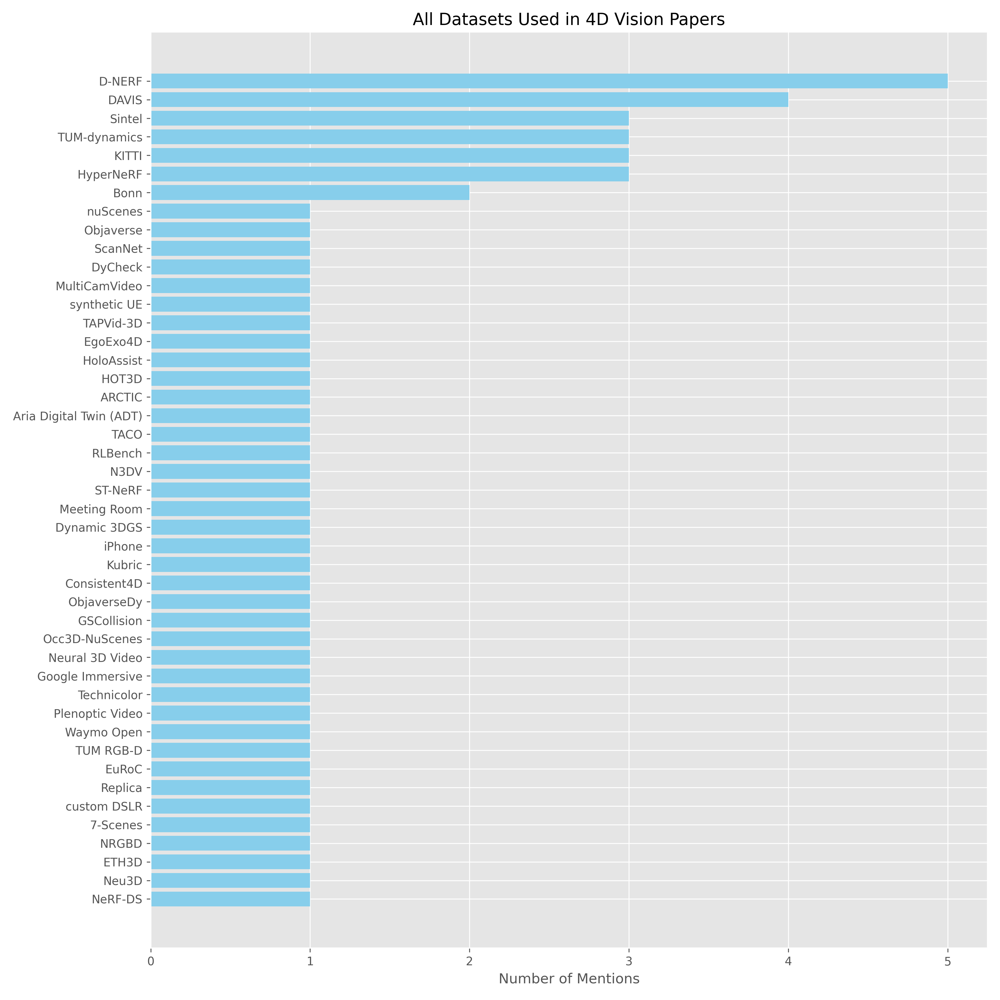
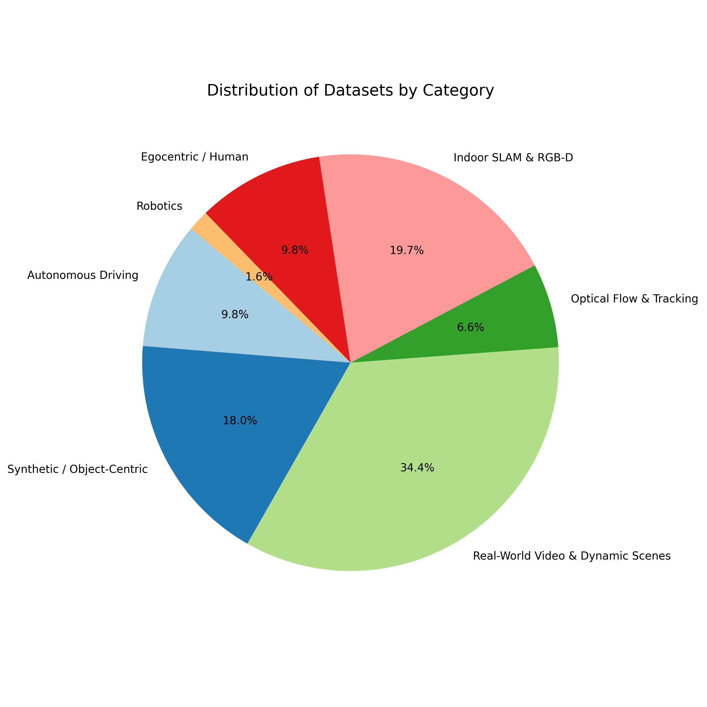
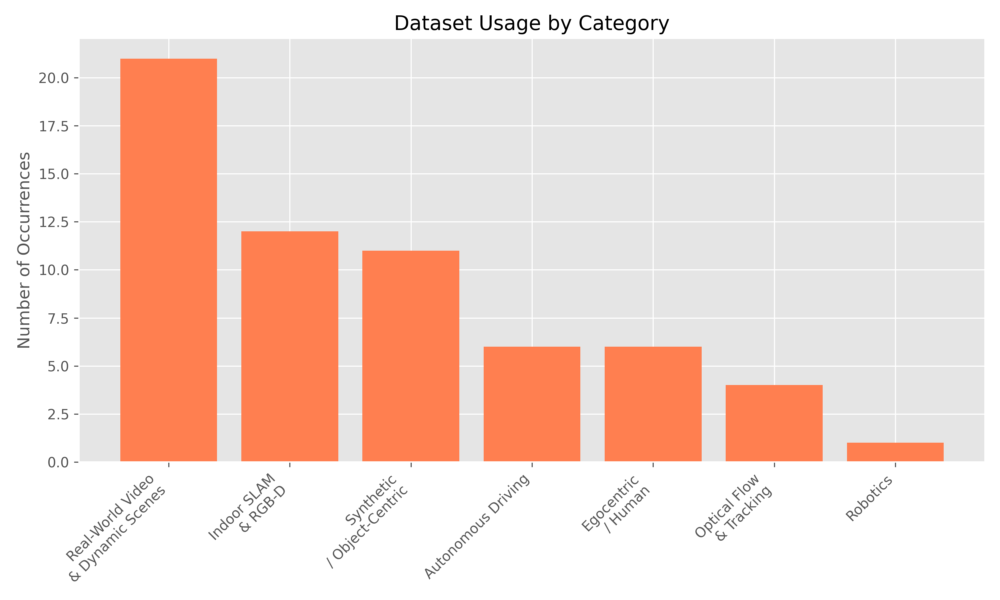

# Dataset Analysis for 4D Vision Literature Review

This document provides a comprehensive analysis of the datasets utilized across the reviewed 4D vision and generative modeling papers.

## 1. All Datasets Overview

The following datasets are used across the state-of-the-art papers:

## 2. Dataset Categorization

To better understand the trends and applications, we categorize the datasets into main research domains:

### Autonomous Driving
- **nuScenes** (1 uses)
- **KITTI** (3 uses)
- **Waymo Open** (1 uses)
- **Occ3D-NuScenes** (1 uses)

### Synthetic / Object-Centric
- **Objaverse** (1 uses)
- **ObjaverseDy** (1 uses)
- **Kubric** (1 uses)
- **D-NERF** (5 uses)
- **Consistent4D** (1 uses)
- **GSCollision** (1 uses)
- **synthetic UE** (1 uses)

### Real-World Video & Dynamic Scenes
- **DAVIS** (4 uses)
- **MultiCamVideo** (1 uses)
- **iPhone** (1 uses)
- **Neural 3D Video** (1 uses)
- **Google Immersive** (1 uses)
- **Technicolor** (1 uses)
- **Plenoptic Video** (1 uses)
- **HyperNeRF** (3 uses)
- **Neu3D** (1 uses)
- **NeRF-DS** (1 uses)
- **N3DV** (1 uses)
- **ST-NeRF** (1 uses)
- **Meeting Room** (1 uses)
- **Dynamic 3DGS** (1 uses)
- **custom DSLR** (1 uses)
- **DyCheck** (1 uses)

### Optical Flow & Tracking
- **Sintel** (3 uses)
- **TAPVid-3D** (1 uses)

### Indoor SLAM & RGB-D
- **TUM-dynamics** (3 uses)
- **Bonn** (2 uses)
- **ScanNet** (1 uses)
- **TUM RGB-D** (1 uses)
- **EuRoC** (1 uses)
- **Replica** (1 uses)
- **7-Scenes** (1 uses)
- **NRGBD** (1 uses)
- **ETH3D** (1 uses)

### Egocentric / Human
- **EgoExo4D** (1 uses)
- **HoloAssist** (1 uses)
- **HOT3D** (1 uses)
- **ARCTIC** (1 uses)
- **Aria Digital Twin (ADT)** (1 uses)
- **TACO** (1 uses)

### Robotics
- **RLBench** (1 uses)

## 3. Key Observations & Trends

1. **Dominance of D-NeRF & Real-World Captures**: The *D-NERF* remains a staple for evaluating synthetic dynamic scene reconstruction. However, there's a strong trend towards in-the-wild captures like *DAVIS* and *HyperNeRF*, showing that the field is moving away from synthetic limitations to real-world robustness.
2. **Indoor SLAM and Optical Flow Legacies**: Datasets traditionally used for SLAM (like *TUM-dynamics*, *Bonn*, *KITTI*) and optical flow (*Sintel*) are being repurposed to evaluate the geometric consistency and streaming capabilities of modern 4D reconstruction methods (e.g., in MoRe, StreamVGGT).
3. **Rise of Specialized GenAI Datasets**: The introduction of new massive datasets tailored for specific tasks—such as *ObjaverseDy* (4D generation), *GSCollision* (physics/collision), and *EgoExo4D* (egocentric)—highlights the data bottleneck in current 4D generative AI.
4. **Autonomous Driving**: The consistent use of *nuScenes*, *KITTI*, and *Waymo* shows that autonomous driving remains a primary practical application for dynamic 3D/4D modeling, pushing advancements in temporal consistency and large-scale point cloud generation.
