## Summary of Papers

| Name of the paper | Conference-Year | Main Problem Statement | Category | 3D Representation | Motion Representation |
| :--- | :--- | :--- | :--- | :--- | :--- |
| [1. LiDARCrafter: Dynamic 4D World Modeling from LiDAR Sequences](#1-lidarcrafter-dynamic-4d-world-modeling-from-lidar-sequences-aaai-2026--arxiv-2025) | AAAI 2026 / arXiv 2025 | Extending LiDAR generation to dynamic 4D world modeling for autonomous driving, which presents challenges in controllability, temporal coherence, and evaluation standardization. | LiDAR-to-4D, 4D-generation | Point Clouds (LiDAR) | Object-Centric Layouts & Scene Graphs |
| [2. Sculpt4D: Generating 4D Shapes via Sparse-Attention Diffusion Transformers](#2-sculpt4d-generating-4d-shapes-via-sparse-attention-diffusion-transformers-arxiv-2026) | arXiv 2026 | Synthesizing high-fidelity 4D assets from videos, which requires coherent motion and consistent identity while overcoming extreme computational complexity and data scarcity. | Video-to-4D | Meshes | Implicit Spatiotemporal Latent Modeling |
| [3. MoRe: Motion-aware Feed-forward 4D Reconstruction Transformer](#3-more-motion-aware-feed-forward-4d-reconstruction-transformer-arxiv-2026) | arXiv 2026 | Fast, generalizable, and robust 4D scene reconstruction from monocular videos, avoiding the high computational cost of optimization methods while handling dynamic objects that corrupt camera pose estimation in streaming or long sequences. | Video-to-4D | Point Clouds / Depth | Implicit Spatiotemporal Latent Modeling |
| [4. World from Motion: Generative Dynamic Gaussian Reconstruction from Monocular Video](#4-world-from-motion-generative-dynamic-gaussian-reconstruction-from-monocular-video-arxiv-2026) | arXiv 2026 | Synthesizing highly precise, temporally consistent, and freely renderable dynamic 3D representations (4D reconstruction) from monocular video, overcoming the trade-off between geometric rigor and generative expressivity. | Video-to-4D | 3DGS | Explicit 3D Trajectory Fields & Scene Flow |
| [5. OmniX: Any-view and Any-time 4D Reconstruction via Feed-forward Trajectory Fields](#5-omnix-any-view-and-any-time-4d-reconstruction-via-feed-forward-trajectory-fields-eccv-2026--arxiv-2026) | ECCV 2026 / arXiv 2026 | Previous feed-forward 4D reconstruction methods either predict per-frame point clouds (ignoring motion) or track points under limited camera motion, failing to aggregate observations across time and large viewpoint changes. | Video-to-4D | Point Clouds / Depth | Explicit 3D Trajectory Fields & Scene Flow |
| [6. ReViV: Reconstructing the Viewer and the View in 4D from Monocular Egocentric Video](#6-reviv-reconstructing-the-viewer-and-the-view-in-4d-from-monocular-egocentric-video-eccv-2026--arxiv-2026) | ECCV 2026 / arXiv 2026 | Existing egocentric 4D reconstruction methods often treat scene perception and human ego-motion as separate problems, depend heavily on pre-computed camera trajectories or auxiliary priors, and suffer from slow inference time. | Video-to-4D | Tokenized Representation | Discretized Token Sequences |
| [7. VistaBot: View-Robust Robot Manipulation via Spatiotemporal-Aware View Synthesis](#7-vistabot-view-robust-robot-manipulation-via-spatiotemporal-aware-view-synthesis-icra-2026--arxiv-2026) | ICRA 2026 / arXiv 2026 | End-to-end robotic manipulation models (like ACT or VLAs) suffer from poor generalization across camera viewpoints, requiring specific camera positions during testing. | Novel-View-Synthesis, Robotics | Point Clouds | Implicit Spatiotemporal Latent Modeling |
| [8. CAGS: Color-Adaptive Volumetric Video Streaming with Dynamic 3D Gaussian Splatting](#8-cags-color-adaptive-volumetric-video-streaming-with-dynamic-3d-gaussian-splatting-siggraph-2026--arxiv-2026) | SIGGRAPH 2026 / arXiv 2026 | Volumetric Video (VV) streaming of 3D Gaussian Splatting (3DGS) consumes significant bandwidth. Existing density-based Level of Detail (LoD) methods cause severe structural gaps at low bitrates, while existing attribute compression (like Vector Quantization) introduces unacceptable color distortions without scalable LoD support. | Volumetric-Video-Streaming | 3DGS | Deformation Fields & Canonical Spaces |
| [9. Shape of Motion: 4D Reconstruction from a Single Video](#9-shape-of-motion-4d-reconstruction-from-a-single-video-iccv-2025--arxiv-2025) | ICCV 2025 / arXiv 2025 | Monocular dynamic 4D reconstruction is highly ill-posed, as points move while observed from a single viewpoint. Most methods estimate short-range flow or map points to a canonical space, failing to capture explicit, long-range 3D trajectories persistent over the entire video. | Video-to-4D | 3DGS | Low-Dimensional SE(3) Motion Bases |
| [10. SV4D: Dynamic 3D Content Generation with Multi-Frame and Multi-View Consistency](#10-sv4d-dynamic-3d-content-generation-with-multi-frame-and-multi-view-consistency-iclr-2025) | ICLR 2025 | Generating dynamic 3D objects (4D generation) from a single monocular video is challenging because it requires simultaneously reasoning about object appearance and motion across unseen views. Existing optimization-based (SDS) methods are slow and suffer from inconsistencies due to independent video and multi-view models. | Video-to-4D | NeRF | Implicit Spatiotemporal Latent Modeling |
| [11. Learning Physics-Grounded 4D Dynamics with Neural Gaussian Force Fields](#11-learning-physics-grounded-4d-dynamics-with-neural-gaussian-force-fields-iclr-2026) | ICLR 2026 | Predicting physical dynamics from visual data requires accurate scene understanding and robust physics reasoning. Existing approaches using 3D Gaussian splatting with traditional physics engines struggle with complex real-world multi-object interactions and prohibitive computational costs. | Multi-view-to-4D, Physics-Simulation | 3DGS | Physics-Grounded Force Fields |
| [12. Streaming Visual Geometry Transformer](#12-streaming-visual-geometry-transformer-iclr-2026-under-review--arxiv-2026) | ICLR 2026 (Under review) / arXiv 2026 | State-of-the-art feed-forward 3D reconstruction models (like VGGT) rely on global self-attention across all frames, making them computationally expensive, memory-intensive, and unsuited for streaming/online applications where inputs arrive sequentially. | Video-to-4D, Streaming | Point Clouds / Depth | Implicit Spatiotemporal Latent Modeling |
| [13. DeGO: Deformable Gaussian Occupancy: Decoupling Rigid and Nonrigid Motion with Factorized Distillation](#13-dego-deformable-gaussian-occupancy-decoupling-rigid-and-nonrigid-motion-with-factorized-distillation-icml-2026--arxiv-2026) | ICML 2026 / arXiv 2026 | Existing weakly supervised 3D occupancy prediction methods assume rigid-body motion and rely on simple frame-to-frame offsets. This limits their ability to capture the fine-grained nonrigid deformations of human-centric agents (pedestrians, cyclists) and maintain temporal coherence. | Video-to-4D, 4D-Occupancy-Prediction | Voxel-based (Occupancy) | Deformation Fields & Canonical Spaces |
| [14. Spacetime Gaussian Feature Splatting for Real-Time Dynamic View Synthesis](#14-spacetime-gaussian-feature-splatting-for-real-time-dynamic-view-synthesis-cvpr-2024--arxiv-2023) | CVPR 2024 / arXiv 2023 | Novel view synthesis of dynamic scenes faces the challenge of simultaneously achieving high-resolution photorealistic results, real-time rendering, and compact storage. | Video-to-4D, Novel-View-Synthesis | 4DGS | Deformation Fields & Canonical Spaces |
| [15. Real-Time Photorealistic Dynamic Scene Representation and Rendering with 4D Gaussian Splatting](#15-real-time-photorealistic-dynamic-scene-representation-and-rendering-with-4d-gaussian-splatting-iclr-2024--arxiv-2023) | ICLR 2024 / arXiv 2023 | Reconstructing dynamic 3D scenes faces severe scaling challenges when explicitly modeling scene element deformation (like canonical spaces + deformation fields). Existing methods struggle to natively reveal spatial and temporal structure simultaneously. | Video-to-4D, Novel-View-Synthesis | 4DGS | Deformation Fields & Canonical Spaces |
| [16. Dense RGB SLAM with Neural Implicit Maps](#16-dense-rgb-slam-with-neural-implicit-maps-iclr-2023) | ICLR 2023 | Dense visual SLAM (Simultaneous Localization and Mapping) typically relies on RGB-D sensors. Operating without depth inputs (RGB-only) makes dense map reconstruction highly challenging, especially in featureless regions. | Video-to-3D, RGB-SLAM | Neural Implicit Maps | Deformation Fields & Canonical Spaces |
| [17. Fast Dynamic Radiance Fields with Time-Aware Neural Voxels](#17-fast-dynamic-radiance-fields-with-time-aware-neural-voxels-siggraph-asia-2022) | SIGGRAPH Asia 2022 | Conventional Neural Radiance Fields (NeRF) for dynamic scenes take dozens of hours to optimize. While explicit data structures (like voxel grids) have accelerated static NeRFs, applying them to dynamic scenes is challenging due to the massive memory cost of adding a time dimension and the difficulty of capturing both small and large motions. | Video-to-4D, Novel-View-Synthesis | Voxel-based (Neural Voxels) | Deformation Fields & Canonical Spaces |
| [18. D-NeRF: Neural Radiance Fields for Dynamic Scenes](#18-d-nerf-neural-radiance-fields-for-dynamic-scenes-cvpr-2021--arxiv-2020) | CVPR 2021 / arXiv 2020 | Standard NeRF achieves unprecedented photorealism but is strictly applicable to static scenes, failing entirely on scenes with moving or deforming objects because it cannot exploit temporal redundancy. | Video-to-4D, Novel-View-Synthesis | NeRF | Deformation Fields & Canonical Spaces |
| [19. Dynamic Neural Radiance Fields for Monocular 4D Facial Avatar Reconstruction](#19-dynamic-neural-radiance-fields-for-monocular-4d-facial-avatar-reconstruction-cvpr-2021--arxiv-2020) | CVPR 2021 / arXiv 2020 | Reconstructing 4D facial avatars (handling complex hair, reflections, and subsurface scattering) from monocular video is extremely challenging. Classical mesh-based methods struggle with mouth interiors and hair, while 2D image-based methods lack 3D view-consistency. | Video-to-4D, Facial-Avatar | NeRF | Deformation Fields & Canonical Spaces |
| [20. 4D Gaussian Splatting for Real-Time Dynamic Scene Rendering](#20-4d-gaussian-splatting-for-real-time-dynamic-scene-rendering-cvpr-2024--arxiv-2023) | CVPR 2024 / arXiv 2023 | Representing and rendering dynamic scenes efficiently is challenging. NeRF-based methods are slow. While 3D Gaussian Splatting is fast, extending it to dynamic scenes without a massive memory overhead is difficult. | Video-to-4D, Novel-View-Synthesis | 4DGS | Deformation Fields & Canonical Spaces |
| [21. Deformable 3D Gaussians for High-Fidelity Monocular Dynamic Scene Reconstruction](#21-deformable-3d-gaussians-for-high-fidelity-monocular-dynamic-scene-reconstruction-cvpr-2024--arxiv-2023) | CVPR 2024 / arXiv 2023 | Existing implicit neural rendering methods struggle to capture intricate details of objects and fail to achieve real-time rendering in general dynamic scenes. | Video-to-4D, Novel-View-Synthesis | 3DGS | Deformation Fields & Canonical Spaces |
| [22. Dream-in-4D: A Unified Approach for Text- and Image-guided 4D Scene Generation](#22-dream-in-4d-a-unified-approach-for-text--and-image-guided-4d-scene-generation-cvpr-2024--arxiv-2023) | CVPR 2024 / arXiv 2023 | Text-to-4D dynamic scene generation is challenging. Relying solely on video diffusion models leads to the Janus problem (multi-view inconsistency) and poor 3D geometry, as video models lack strong 3D awareness. | Text-to-4D, Image-to-4D | NeRF / 3DGS | Implicit Spatiotemporal Latent Modeling |

---

# 1. LiDARCrafter: Dynamic 4D World Modeling from LiDAR Sequences (AAAI 2026 / arXiv 2025)

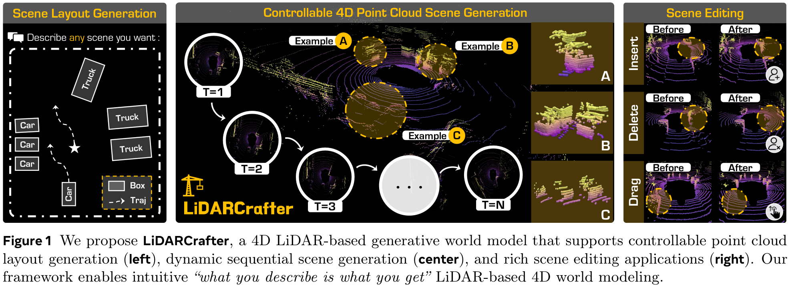
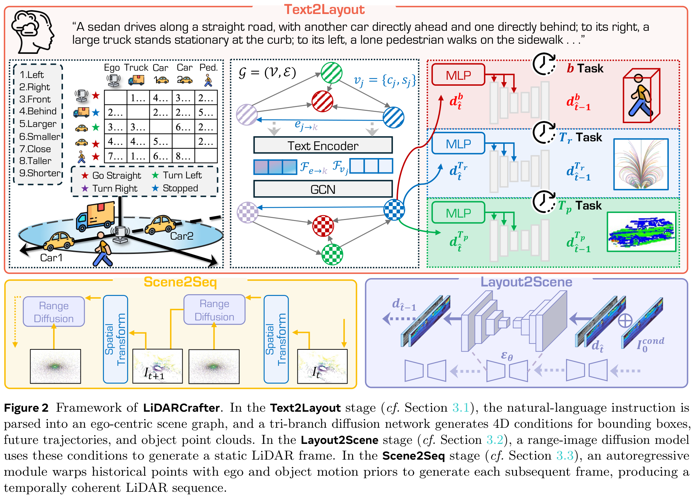

### 1. Metadata
*   **Authors & Lab:** Ao Liang, Youquan Liu, Yu Yang, Dongyue Lu, Linfeng Li, Lingdong Kong, Huaici Zhao, Wei Tsang Ooi (WorldBench Team)
*   **Code/Data Availability:** https://github.com/worldbench/lidarcrafter

### 2. Core Contribution
*   **Main Problem Statement:** Extending LiDAR generation to dynamic 4D world modeling for autonomous driving, which presents challenges in controllability, temporal coherence, and evaluation standardization.
*   **Novelty / Core Insight:** The use of an explicit, object-centric 4D layout (scene graph) that bridges natural language instructions and geometric point clouds, combined with an autoregressive generation mechanism that warps previously observed points to maintain strong temporal coherence.
*   **Methodology / Key Ideas:** A three-stage process: Text2Layout (LLM parses text to a scene graph, and a tri-branch diffusion network generates object boxes, trajectories, and shape priors), Layout2Scene (a range-image diffusion model generates the first high-fidelity static scan conditioned on the layout), and Scene2Seq (autoregressively warps past background/foreground points with motion priors to guide sequence synthesis).
*   **Achievements (Results):** Achieved state-of-the-art single-frame fidelity (e.g., FRD 194.37, FPD 8.64 on nuScenes) and temporal consistency (TTCE 2.65, CTC 1.12), outperforming baselines like UniScene, OpenDWM, and LiDARGen.

### 3. Critical Analysis
*   **Datasets & Baselines:** nuScenes dataset. Baselines include LiDARGen, LiDM, RangeLDM, R2DM, UniScene, OpenDWM, and OpenDWM-DiT.
*   **Underlying Assumptions:** Assumes that LiDAR sweeps see a mostly static environment with only the ego vehicle and annotated objects moving, relying on warping historical points for temporal consistency. Assumes sufficient bounding box supervision for training the layout generation.
*   **Limitations / Failure Cases:** Autoregressive design can lead to error accumulation and mode collapse over long sequences (e.g., blurring in later frames). It relies on the accuracy of the intermediate layout generation; conditioning mechanisms might not cover highly heterogeneous scenes. Fails to bridge voxel and range-based representations.
*   **Future Work:** Integrating geometric information from historical frames via inpainting to mitigate error accumulation. Developing unified frameworks that align range and voxel representations to leverage both fidelity and temporal/conditional flexibility.
*   **Strategic Relevance:** The decoupled tri-branch layout generation and the autoregressive static/dynamic point warping strategy provide a strong blueprint for future 4D generation models. The newly introduced EvalSuite (incorporating object and layout metrics like FDC, CFCA, SCR) will likely become a standard for evaluating 4D LiDAR generation.

---

# 2. Sculpt4D: Generating 4D Shapes via Sparse-Attention Diffusion Transformers (arXiv 2026)

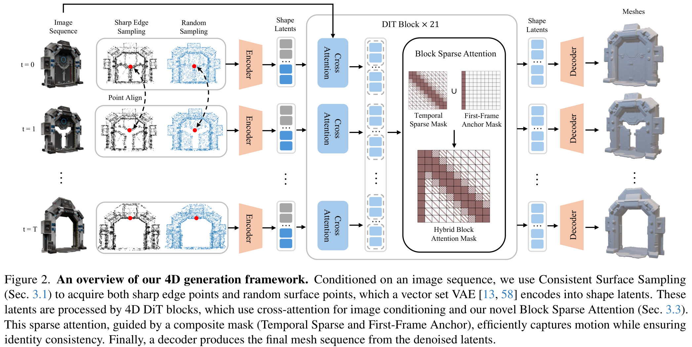

### 1. Metadata
*   **Authors & Lab:** Minghao Yin, Wenbo Hu, Jiale Xu, Ying Shan, Kai Han (The University of Hong Kong, ARC Lab Tencent PCG)
*   **Code/Data Availability:** https://visual-ai.github.io/sculpt4d

### 2. Core Contribution
*   **Main Problem Statement:** Synthesizing high-fidelity 4D assets from videos, which requires coherent motion and consistent identity while overcoming extreme computational complexity and data scarcity.
*   **Novelty / Core Insight:** A native 4D generative model that integrates a "Block Sparse Attention" mechanism directly into a pretrained 3D Diffusion Transformer (Hunyuan3D). It uses a "First-Frame Anchor" for global identity preservation and a "Time-Decaying Sparsity" mask to capture motion efficiently without the quadratic cost of full spatiotemporal attention.
*   **Methodology / Key Ideas:** Extends Hunyuan3D 2.1 by separating spatial and temporal modeling in the DiT block. The temporal self-attention uses Block Sparse Attention, reducing complexity by limiting attention to the first frame and a temporally-strided subset of local frames (decaying stride over distance). Ensures temporally consistent shape latents via a canonical mesh mapping and shared stochastic noise in the VAE encoder.
*   **Achievements (Results):** Achieved state-of-the-art results in 4D mesh generation from video. Reduced network total computation by 56% compared to full attention while matching or exceeding the geometric and temporal fidelity (Chamfer 0.0972, F-Score 0.3383) of baselines like V2M4, L4GM, and GVFD.

### 3. Critical Analysis
*   **Datasets & Baselines:** Evaluated on 50 holdout 4D models from Objaverse and in-the-wild videos from DAVIS dataset. Baselines include L4GM, V2M4, GVFD, and per-frame Hunyuan3D.
*   **Underlying Assumptions:** Assumes that a base 3D DiT (Hunyuan3D) provides a sufficient spatial prior. Assumes that distant frames primarily provide semantic context (which can be sparsely sampled) rather than high-frequency motion details. Assumes object meshes can be consistently sampled and mapped to a canonical rest pose for VAE encoding.
*   **Limitations / Failure Cases:** The reliance on an initial anchor frame implies that severe occlusions or topological changes that completely depart from the first frame might not be handled perfectly, although the sparse mask helps. Extracting consistent meshes for VAE training relies on an unsigned distance field and marching cubes, which could struggle with very thin structures.
*   **Future Work:** While not explicitly highlighted in a dedicated section, the scaling analysis (up to 64 frames) suggests future directions towards longer, infinite-length sequence generation and scaling the sparse attention to even larger foundation models.
*   **Strategic Relevance:** The Block Sparse Attention mechanism (First-Frame Anchor + Time-Decaying Sparsity) is highly reusable for any transformer-based spatiotemporal generation task (video, 4D point clouds, etc.) to break the quadratic bottleneck without sacrificing global consistency.

---

# 3. MoRe: Motion-aware Feed-forward 4D Reconstruction Transformer (arXiv 2026)

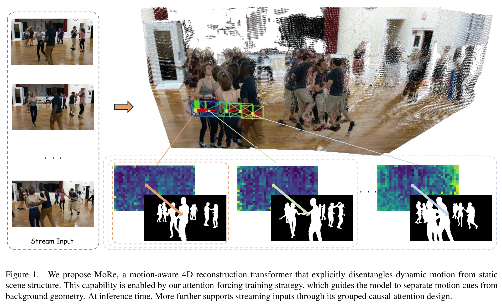
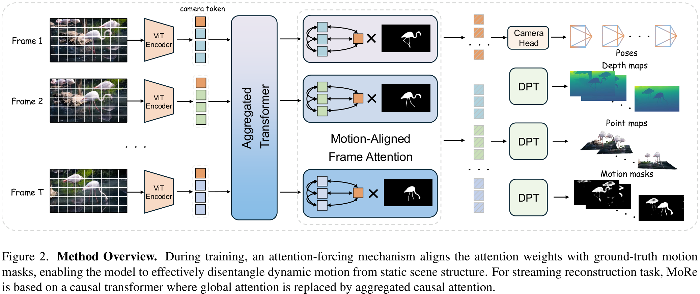

  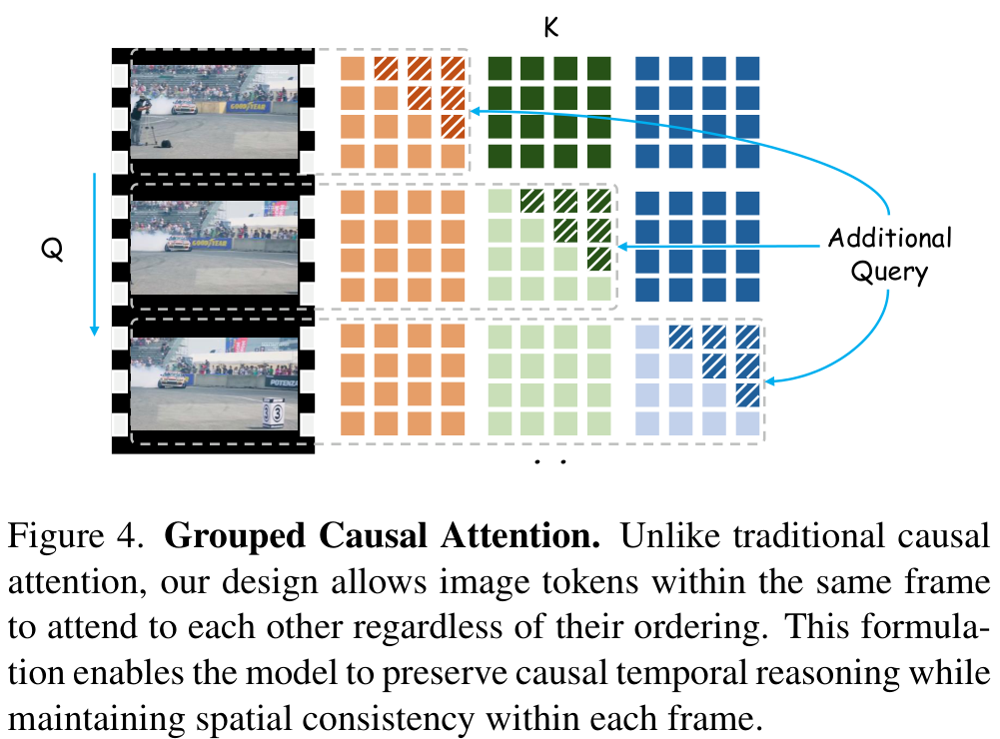
  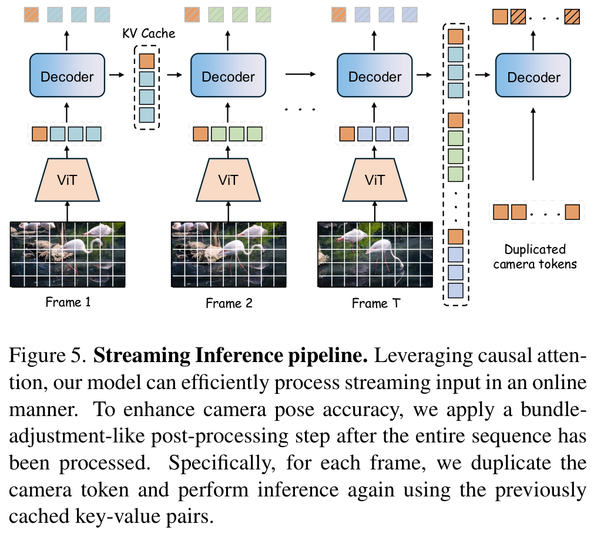

### 1. Metadata
*   **Authors & Lab:** Junton Fang, Zequn Chen, Weiqi Zhang, Donglin Di, Xuancheng Zhang, Chengmin Yang, Yu-Shen Liu (School of Software, Tsinghua University, Beijing, China; Li Auto)
*   **Code/Data Availability:** https://hellexf.github.io/MoRe/

### 2. Core Contribution
*   **Main Problem Statement:** Fast, generalizable, and robust 4D scene reconstruction from monocular videos, avoiding the high computational cost of optimization methods while handling dynamic objects that corrupt camera pose estimation in streaming or long sequences.
*   **Novelty / Core Insight:** An attention-forcing strategy during training that explicitly guides the model to disentangle dynamic motion from the static background without needing explicit motion priors during inference. Coupled with a grouped causal attention mechanism for real-time streaming inference.
*   **Methodology / Key Ideas:** A feed-forward transformer architecture. The attention-forcing strategy uses ground-truth motion masks during training to modulate the attention weights (penalizing attention to dynamic regions), teaching the network to focus on static geometry for pose estimation. At inference, it uses "grouped causal attention" combined with a lightweight bundle-adjustment-like global refinement (by caching and aggregating features) to maintain long-range temporal dependencies without breaking intra-frame spatial coherence.
*   **Achievements (Results):** Achieved state-of-the-art accuracy in dynamic 4D reconstruction across multiple benchmarks (Sintel, TUM-dynamics, Bonn). For example, it outperforms full-attention baselines like VGGT and streaming baselines like Stream3R in camera pose estimation (ATE 0.1474 on Sintel) and video depth estimation, operating at ~30 FPS on KITTI.

### 3. Critical Analysis
*   **Datasets & Baselines:** Evaluated on Sintel, TUM-dynamics, Bonn, ScanNet (static), KITTI, and DAVIS. Baselines include MapAnything, VGGT, Spann3R, CUT3R, StreamVGGT, Wint3R, Stream3R, and pi^3.
*   **Underlying Assumptions:** Assumes that ground-truth motion masks can be reliably extracted during training (using an automated pipeline with SAM2 and SEA-RAFT optical flow). Assumes that scenes contain sufficient static background to accurately estimate camera poses and reconstruct geometry.
*   **Limitations / Failure Cases:** The model heavily relies on the quality of the pseudo-ground-truth motion masks during training; noisy masks lead to degraded reconstruction. The feed-forward streaming nature struggles to capture extremely long-term temporal dependencies beyond the modeled window, and it may fail in scenes with severe motion blur or extremely fast/non-rigid motions where visual cues are degraded.
*   **Future Work:** Exploring robust or self-supervised techniques to mitigate imperfect motion supervision. Integrating explicit handling of occlusions or severe appearance changes to prevent artifacts in reconstructed 4D scenes.
*   **Strategic Relevance:** The idea of using soft penalty priors (attention-forcing via mask scores) during training to enforce functional disentanglement within a transformer (static vs. dynamic) without altering the inference architecture is a highly practical technique for any mixed-dynamics scene modeling task.

---

# 4. World from Motion: Generative Dynamic Gaussian Reconstruction from Monocular Video (arXiv 2026)

### 1. Metadata
*   **Authors & Lab:** Liyuan Zhu, Shengyu Huang, Amrita Mazumdar, Tianye Li, Zan Gojcic, Gordon Wetzstein, Iro Armeni, Shalini De Mello, Alex Trevithick (Stanford University, NVIDIA)
*   **Code/Data Availability:** https://research.nvidia.com/labs/amri/projects/world-from-motion/

### 2. Core Contribution
*   **Main Problem Statement:** Synthesizing highly precise, temporally consistent, and freely renderable dynamic 3D representations (4D reconstruction) from monocular video, overcoming the trade-off between geometric rigor and generative expressivity.
*   **Novelty / Core Insight:** Conditioning a video generative model directly on dense 4D buffers (appearance, geometry, and 3D scene flow) rendered from an initial, imperfect dynamic 3D Gaussian Splatting (3DGS) representation along both input and target camera trajectories, and then distilling the generated novel views back into the 3DGS representation.
*   **Methodology / Key Ideas:** 1) Initial reconstruction via off-the-shelf monocular 4D (e.g. MoSca). 2) Generate target videos: a DiT video generator (Wan-2.1-14B) is adapted with a VACE-style adapter to condition on rendered 4D buffers (RGB, depth, normals, 3D flow) from the initial 3DGS, alongside camera pose control. 3) Reoptimization: The initial 3DGS is refined by jointly optimizing against both the input video and the generatively synthesized novel views, recovering missing regions and correcting corrupted dynamics.
*   **Achievements (Results):** Set a new SOTA on the DyCheck benchmark for perceptual quality (e.g. PSNR 19.96, LPIPS 0.218 under static camera eval). Successfully synthesizes complex out-of-frustum dynamics and outpainting while respecting the geometric fidelity of the static scene.

### 3. Critical Analysis
*   **Datasets & Baselines:** Evaluated on DyCheck and MultiCamVideo datasets. Baselines include Shape of Motion, MoSca, WorldTree (reconstruction methods) and ViDAR, CAT4D, Vista4D, ReCamMaster, TrajectoryCrafter (generative methods).
*   **Underlying Assumptions:** Assumes the initial 4D reconstruction provides a minimally viable geometric and dynamic scaffold; if the initial reconstruction fails completely, the generative model cannot recover. Assumes that optimizing 3DGS from synthesized 2D views converges to a coherent 3D structure without generating conflicting multi-view artifacts.
*   **Limitations / Failure Cases:** Fails in scenes with complex stochastic or volumetric effects (e.g., fluids, smoke). May struggle to hallucinate consistent dynamics under extreme viewpoint shifts. Extremely high computational requirements (trained on 32 Blackwell GB200s; inference takes ~40 minutes per sequence on an A100).
*   **Future Work:** Incorporating multiple rounds of alternation between refinement and sampling to progressively boost quality. Using the approach as a basis for memory and persistence in broader video generative modeling.
*   **Strategic Relevance:** Demonstrates a powerful hybrid paradigm ("Analysis by Synthesis" loop) where explicit 4D representations (3DGS) serve as the memory/scaffold that grounds a massive 2D video diffusion model, which in turn acts as a powerful prior for filling in the unobserved geometry and dynamics. This bidirectional distillation is a blueprint for next-generation 4D foundation models.

---

# 5. OmniX: Any-view and Any-time 4D Reconstruction via Feed-forward Trajectory Fields (ECCV 2026 / arXiv 2026)

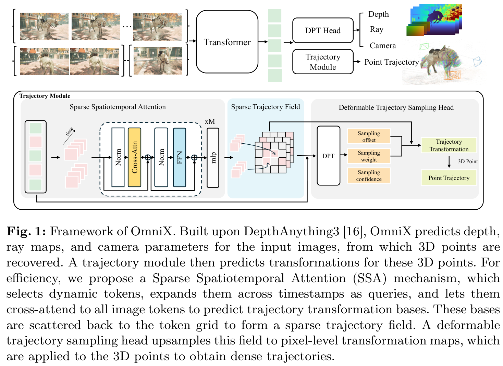

### 1. Metadata
*   **Authors & Lab:** Yanqin Jiang, Tengfei Wang, Zhengwei Wang, Chenjie Cao, Junta Wu, Wenhan Luo, Weiming Hu, Jin Gao, and Chunchao Guo (MAIS, Institute of Automation, Chinese Academy of Sciences; Tencent Hunyuan)
*   **Code/Data Availability:** https://omnix4d.github.io/

### 2. Core Contribution
*   **Main Problem Statement:** Previous feed-forward 4D reconstruction methods either predict per-frame point clouds (ignoring motion) or track points under limited camera motion, failing to aggregate observations across time and large viewpoint changes.
*   **Novelty / Core Insight:** OmniX separates dynamic motion modeling from static geometry and parameterizes 3D motion using a compact set of "dynamic tokens." These tokens leverage Sparse Spatiotemporal Attention (SSA) to generate trajectory fields for all pixels in all images in a single feed-forward pass.
*   **Methodology / Key Ideas:** Employs a transformer backbone to predict depth and 3D geometry from images. Introduces a trajectory module with SSA that explicitly selects dynamic tokens and applies cross-attention to all image tokens to establish spatiotemporal correspondences efficiently. The trajectory field is upsampled via a Deformable Trajectory Sampling Head (DTSH) to produce dense per-pixel 3D trajectories. Also built an automated UE5-based 4D data engine to generate 80K scenes and 1.28M multi-view videos with dense trajectory annotations.
*   **Achievements (Results):** Achieves state-of-the-art results in dense 3D point trajectory prediction (e.g., APD3D 0.381 on validation) and 3D point tracking (on TAPVid-3D). Offers competitive depth and camera pose estimation, balancing high accuracy with efficiency.

### 3. Critical Analysis
*   **Datasets & Baselines:** Evaluated on synthetic UE dataset validation set, TAPVid-3D, DAVIS, KITTI, Sintel, TUM-dynamic. Baselines include SpatialTrackerV2, St4RTrack, TraceAnything, VDPM.
*   **Underlying Assumptions:** Assumes that 3D motion is inherently sparse and low-rank, allowing it to be effectively modeled by a small subset of dynamic tokens (e.g., top 20%). Assumes that static geometry and dynamic motion can be cleanly disentangled to prevent background/foreground distraction.
*   **Limitations / Failure Cases:** High memory consumption because it natively predicts all trajectories in a single forward pass rather than relying on an iterative inference loop. It may also struggle when dynamic objects occupy a very large portion of the scene or exhibit extremely complex, non-rigid topological changes where the sparse token representation is insufficient.
*   **Future Work:** Extending the model to longer sequences (beyond the 16-frame chunks used in training) without exponential memory growth, or adapting to highly articulated objects without tracking failures, is implied.
*   **Strategic Relevance:** The Sparse Spatiotemporal Attention (SSA) and the UE5 data engine provide significant contributions. SSA demonstrates a highly efficient way to model global dense 3D trajectories without iterative test-time optimization, paving the way for real-time 4D tracking and reconstruction foundation models.

---

# 6. ReViV: Reconstructing the Viewer and the View in 4D from Monocular Egocentric Video (ECCV 2026 / arXiv 2026)

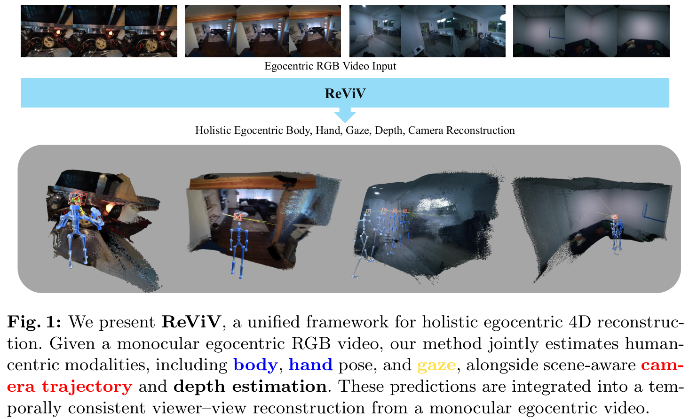
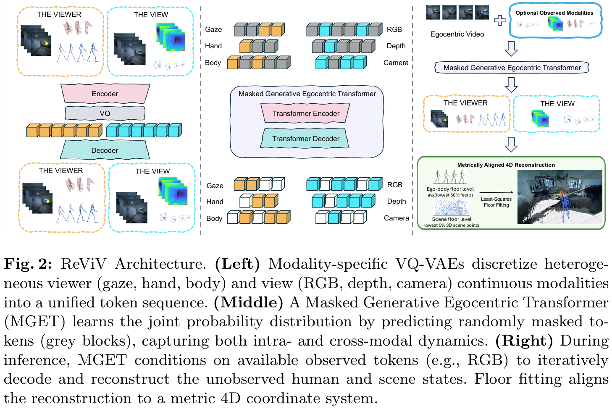

### 1. Metadata
*   **Authors & Lab:** Xiaozhong Lyu, Gen Li, Zhiyin Qian, Xucong Zhang, Marc Pollefeys, and Siyu Tang (ETH Zurich, Switzerland; Microsoft, Switzerland)
*   **Code/Data Availability:** https://reviv4d.github.io/

### 2. Core Contribution
*   **Main Problem Statement:** Existing egocentric 4D reconstruction methods often treat scene perception and human ego-motion as separate problems, depend heavily on pre-computed camera trajectories or auxiliary priors, and suffer from slow inference time.
*   **Novelty / Core Insight:** ReViV is the first unified framework to holistically reconstruct both the viewer (full-body, hand, gaze) and the view (camera trajectory, depth) from a single monocular RGB video in a single feed-forward pass. It formulates this as learning the full joint probability distribution over multimodal signals via masked generative modeling.
*   **Methodology / Key Ideas:** Utilizes Modality-specific VQ-VAEs to discretize heterogeneous continuous signals (gaze, hand, body, depth, camera) into a unified token sequence. A Masked Generative Egocentric Transformer (MGET) learns inter-modal dependencies and intra-modal dynamics by predicting randomly masked tokens. At inference, MGET conditions on RGB video context to iteratively decode unobserved kinematics and scene geometry, followed by a floor-fitting metric alignment step.
*   **Achievements (Results):** Sets a new SOTA for holistic egocentric reconstruction on benchmarks like HoloAssist, HOT3D, ARCTIC, Aria Digital Twin, and TACO. Achieves this with an inference speed of ~0.7s per clip, orders of magnitude faster than optimization-based baselines like Dyn-HaMR (280s).

### 3. Critical Analysis
*   **Datasets & Baselines:** Trained on a scaled 7B-token dataset merging EgoExo4D, HoloAssist, HOT3D, ARCTIC, etc. Evaluated on ADT, HoloAssist, HOT3D, ARCTIC, TACO. Baselines include EgoAllo, UniEgoMotion, HaMeR, Dyn-HaMR, EgoM2P, EgoMono4D, VIPE.
*   **Underlying Assumptions:** Assumes that a discrete tokenization of continuous kinematic and geometric signals (via VQ-VAE) retains sufficient fidelity for accurate reconstruction. Assumes the viewer's body and hands are highly correlated with the egocentric visual input, allowing masked token prediction to infer severely occluded kinematics.
*   **Limitations / Failure Cases:** The quantization process inherently discards high-frequency spatial details, slightly limiting depth estimation capacity compared to task-specific continuous regression models. It also relies on the assumption that a floor plane or external metric depth prior is available for final metric alignment; if absent, scale ambiguity persists.
*   **Future Work:** Exploring the integration of continuous generative priors, such as conditional diffusion models, into the decoding stage to retain multimodal reasoning while recovering fine-grained geometric details.
*   **Strategic Relevance:** Demonstrates that masked generative modeling across heterogeneous, discretized modalities (kinematics + geometry + appearance) is a highly scalable and effective paradigm for unified egocentric perception.

---

# 7. VistaBot: View-Robust Robot Manipulation via Spatiotemporal-Aware View Synthesis (ICRA 2026 / arXiv 2026)

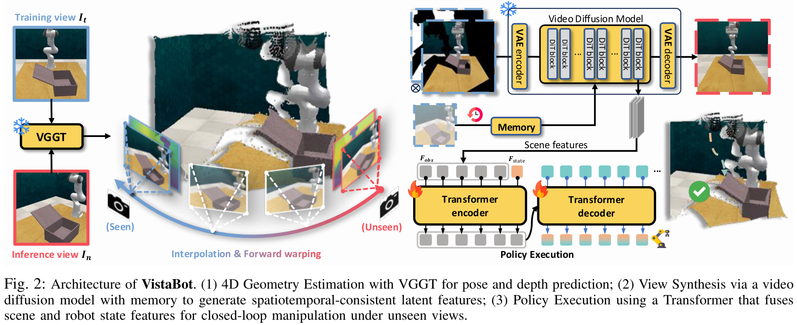

### 1. Metadata
*   **Authors & Lab:** Songen Gu, Yuhang Zheng, Weize Li, Yupeng Zheng, Yating Feng, Xiang Li, Yilun Chen, Pengfei Li, Wenchao Ding (Fudan University, TARS Robotics, UCAS, NUS)
*   **Code/Data Availability:** Code and models to be made publicly available (no link provided).

### 2. Core Contribution
*   **Main Problem Statement:** End-to-end robotic manipulation models (like ACT or VLAs) suffer from poor generalization across camera viewpoints, requiring specific camera positions during testing.
*   **Novelty / Core Insight:** Fuses a feed-forward geometric model with a video diffusion model to synthesize novel views that are spatiotemporally consistent. This allows the manipulation policy to operate directly on viewpoint-robust latent features (the synthesis latent) without requiring explicit camera calibration at test time.
*   **Methodology / Key Ideas:** 1) 4D Geometry Estimation: Fine-tunes VGGT to estimate depth and relative camera pose to lift 2D observations to 3D point clouds. 2) Synthesis Latent Extraction: Interpolates camera poses and uses a conditional video diffusion model (CogVideoX) with a temporal memory mechanism to generate spatiotemporally consistent features representing the training viewpoint. 3) Latent Action Learning: The policy operates directly on the diffusion model's latent representation rather than decoded images, enabling efficient closed-loop manipulation. Also introduces the View Generalization Score (VGS) metric.
*   **Achievements (Results):** Evaluated in both simulation (RLBench) and real-world setups. VistaBot improves VGS by 2.79x over ACT and 2.63x over \pi_0, maintaining high task success rates even under substantial camera viewpoint changes (e.g., 45 degrees).

### 3. Critical Analysis
*   **Datasets & Baselines:** Evaluated on RLBench (8 tasks) and real-world experiments (4 tasks) using Franka FR3 arm. Baselines include ACT, \pi_0, and view synthesis methods AnySplat and LangScene-X.
*   **Underlying Assumptions:** Assumes that a feed-forward geometric model can sufficiently estimate relative camera poses and depth from a single arbitrary novel view. Assumes the target training view can be adequately hallucinated/synthesized from the novel view using a video diffusion prior.
*   **Limitations / Failure Cases:** The model struggles to generate high-quality synthesized views under severe occlusions. The reliance on accurate depth and pose estimation means that if the geometric model fails completely, the diffusion model's generation will drift.
*   **Future Work:** Explore robust handling of severe occlusions without sacrificing synthesis speed and maintaining closed-loop efficiency.
*   **Strategic Relevance:** By integrating geometric priors (for structural consistency) and diffusion priors (for spatiotemporal completion), VistaBot offers a highly scalable solution for view-invariant robot manipulation, allowing generalist policies to be deployed without rigid camera setups.

---

# 8. CAGS: Color-Adaptive Volumetric Video Streaming with Dynamic 3D Gaussian Splatting (SIGGRAPH 2026 / arXiv 2026)

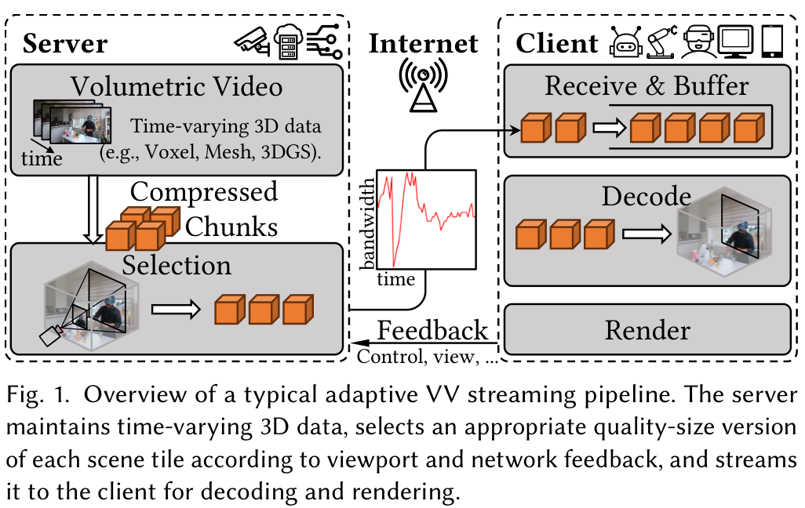
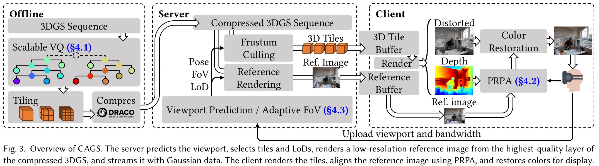

### 1. Metadata
*   **Authors & Lab:** Daheng Yin, Yili Jin, Jianxin Shi, Isaac Ding, Miao Zhang, Fangxin Wang, Zhaowu Huang, Cong Zhang, Jiangchuan Liu, Fang Dong (Simon Fraser University, Jiangxing Intelligence Inc., McGill University, Nankai University, CUHK Shenzhen, Fuzhou University, Southeast University)
*   **Code/Data Availability:** https://github.com/yindaheng98/ColorAdaptiveGaussianSplatting

### 2. Core Contribution
*   **Main Problem Statement:** Volumetric Video (VV) streaming of 3D Gaussian Splatting (3DGS) consumes significant bandwidth. Existing density-based Level of Detail (LoD) methods cause severe structural gaps at low bitrates, while existing attribute compression (like Vector Quantization) introduces unacceptable color distortions without scalable LoD support.
*   **Novelty / Core Insight:** A Color Adaptation scheme that uses Scalable Vector Quantization (SVQ) to heavily compress Gaussian attributes (creating scalable LoDs) and corrects the resulting color distortions on the client side using a low-resolution reference image rendered on the server.
*   **Methodology / Key Ideas:** 1) SVQ builds a hierarchical codebook to establish LoDs based on quantization error. 2) The server predicts the client viewport, selects an Adaptive Field of View (FoV) using an LSTM, and renders a low-res reference image. 3) The client decodes the compressed Gaussians, renders them, and then applies Post-Render Perspective Alignment (PRPA) to align the server's reference image with the actual client viewport. Finally, a lightweight CNN (SRResNet) restores the colors.
*   **Achievements (Results):** Outperforms existing adaptive streaming systems (like LTS-F) by 5-20 dB in PSNR under fluctuating bandwidths (e.g., 30-150 Mbps). Achieves real-time decoding and rendering (e.g., 30 FPS server streaming, 60 FPS client rendering) and generalizes across different Gaussian representations (e.g., Dynamic 3DGS, 4DGS, HiCoM).

### 3. Critical Analysis
*   **Datasets & Baselines:** Evaluated on N3DV, ST-NeRF, Meeting Room, and Dynamic 3DGS datasets. Baselines include LTS-F (density-based LoD) and V^3-A (VQ-based streaming).
*   **Underlying Assumptions:** Assumes the server can predict the client's viewport reasonably well over short network latencies (40-90ms). Assumes that structural information (positions/scales) is preserved sufficiently by SVQ so that only color needs to be "inpainted" or restored using the 2D reference.
*   **Limitations / Failure Cases:** Rapid head movements cause significant viewport prediction errors, leading to missing regions in the PRPA output or forcing the server to use an overly large FoV (which reduces pixel density and restoration quality). Error erosion in PRPA handles occlusions but can still leave artifacts.
*   **Future Work:** Explore more robust artifact handling in the color restoration step without sacrificing real-time speed. Extending the color-adaptive scheme to other 3D representations beyond 3DGS.
*   **Strategic Relevance:** Demonstrates a highly practical hybrid streaming architecture: delegating heavy geometry/structure rendering to the client via highly compressed 3DGS, while transmitting a low-res 2D image from the server to act as a powerful conditioning signal for a lightweight neural color restorer. This circumvents the fundamental bandwidth limits of raw 3DGS streaming.

---

# 9. Shape of Motion: 4D Reconstruction from a Single Video (ICCV 2025 / arXiv 2025)

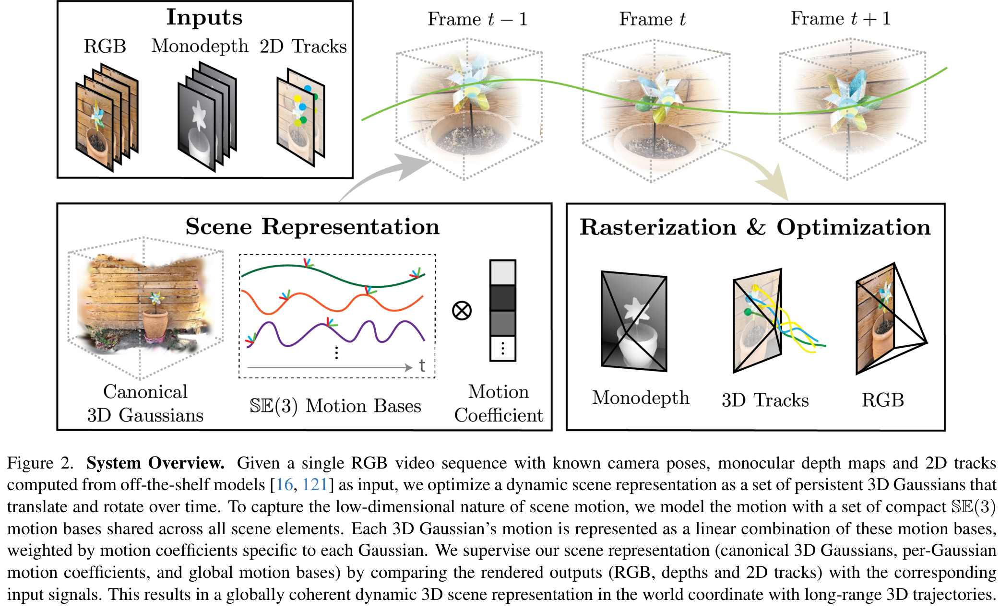

### 1. Metadata
*   **Authors & Lab:** Qianqian Wang, Vickie Ye, Hang Gao, Weijia Zeng, Jake Austin, Zhengqi Li, Angjoo Kanazawa (UC Berkeley, Google DeepMind, UC San Diego, Adobe Research)
*   **Code/Data Availability:** https://shape-of-motion.github.io/

### 2. Core Contribution
*   **Main Problem Statement:** Monocular dynamic 4D reconstruction is highly ill-posed, as points move while observed from a single viewpoint. Most methods estimate short-range flow or map points to a canonical space, failing to capture explicit, long-range 3D trajectories persistent over the entire video.
*   **Novelty / Core Insight:** Represents 3D scene motion using a low-dimensional formulation: a compact set of SE(3) motion bases shared across all scene elements. Each 3D Gaussian's motion is a linear combination of these bases. The method fuses noisy monocular depth and long-range 2D tracks to globally optimize this consistent 4D representation.
*   **Methodology / Key Ideas:** 1) Extracts monocular depth (Depth Anything) and long-range 2D tracks (TAPIR). 2) Represents the dynamic scene as canonical 3D Gaussians and a global set of SE(3) motion bases (e.g., 10 bases) spanning all frames. Each Gaussian has a motion coefficient dictating its combination of the bases. 3) Optimizes the representation by rendering color, depth, and 2D track locations, applying photometric, depth, tracking, and rigidity losses.
*   **Achievements (Results):** State-of-the-art performance in long-range 3D point tracking, 2D tracking, and novel view synthesis on casually captured monocular videos (iPhone dataset). Uniquely enables the extraction of continuous 3D motion "shapes" (trajectories) for any point in the scene.

### 3. Critical Analysis
*   **Datasets & Baselines:** Evaluated on iPhone dataset and Kubric dataset. Baselines for view synthesis include HyperNeRF, D-3DGS, DynIBaR. Tracking baselines include TAPIR+DA, CoTracker+DA, SpatialTracker.
*   **Underlying Assumptions:** Assumes that the underlying 3D scene motion is inherently low-dimensional and can be expressed as a linear combination of a small number of global SE(3) transformations. Assumes off-the-shelf 2D tracking and monocular depth estimators provide sufficient signal (even if noisy) to guide the 3D optimization.
*   **Limitations / Failure Cases:** May struggle with extremely fast, highly non-rigid deformations that violate the low-dimensional SE(3) assumption. The reliance on accurate monocular depth and 2D tracking means catastrophic failures in those priors (e.g., severe occlusions or featureless regions) can degrade the final 4D reconstruction.
*   **Future Work:** Enhancing the motion model to capture more complex non-rigid deformations beyond SE(3) bases, or improving robustness to severe tracking/depth failures in the wild.
*   **Strategic Relevance:** Proposes a highly effective optimization framework that bridges the gap between explicit 3D Gaussian Splatting and long-range motion tracking. The SE(3) basis parameterization acts as a strong structural prior that turns noisy 2D/2.5D cues into coherent 4D trajectories.

---

# 10. SV4D: Dynamic 3D Content Generation with Multi-Frame and Multi-View Consistency (ICLR 2025)

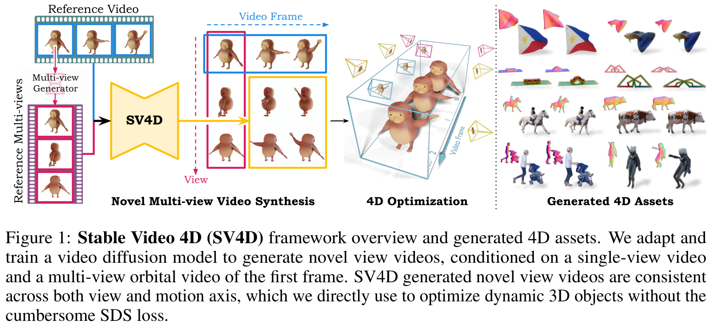
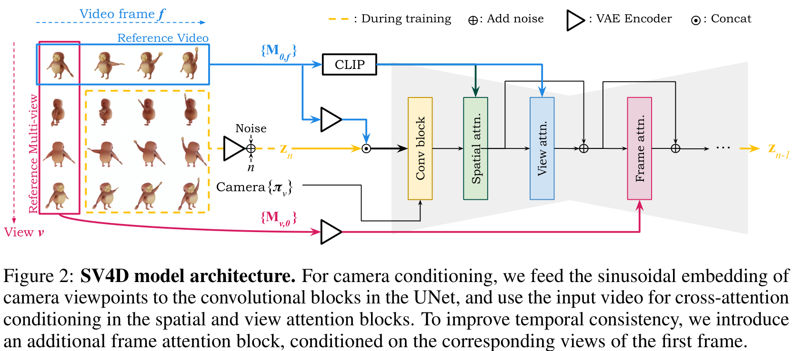
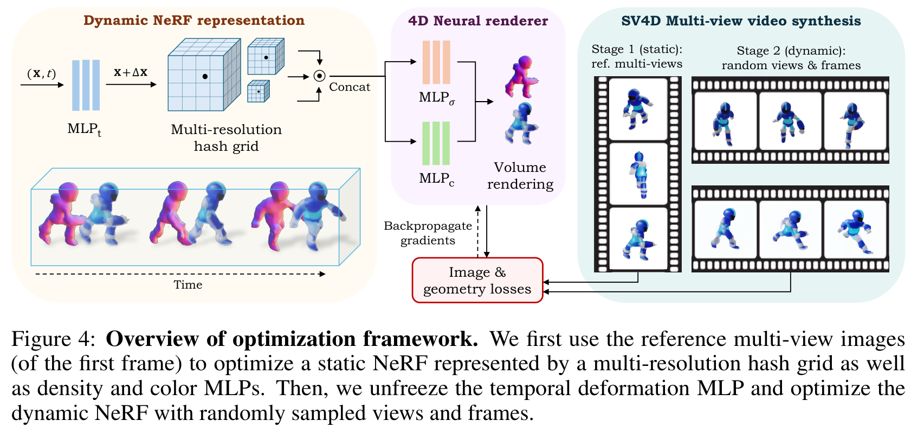

### 1. Metadata
*   **Authors & Lab:** Yiming Xie, Chun-Han Yao, Vikram Voleti, Huaizu Jiang, Varun Jampani (Stability AI, Northeastern University)
*   **Code/Data Availability:** https://sv4d.github.io

### 2. Core Contribution
*   **Main Problem Statement:** Generating dynamic 3D objects (4D generation) from a single monocular video is challenging because it requires simultaneously reasoning about object appearance and motion across unseen views. Existing optimization-based (SDS) methods are slow and suffer from inconsistencies due to independent video and multi-view models.
*   **Novelty / Core Insight:** SV4D is a unified latent video diffusion model that simultaneously reasons across both "frame" (temporal) and "view" (spatial) axes. It generates a V×F grid of multi-view videos and directly optimizes an implicit 4D representation (dynamic NeRF) using these generated consistent views, avoiding cumbersome SDS-based optimization.
*   **Methodology / Key Ideas:** 1) The SV4D network architecture builds on SVD and SV3D, adding both view-attention (aligning multi-view images per frame) and frame-attention (aligning frames per view) conditioned on reference views and the input video. 2) Uses a "mixed sampling" scheme (anchor frames + dense sampling) to sequentially generate arbitrarily long high-resolution multi-view videos despite memory limits. 3) Fine-tuned on the curated ObjaverseDy dataset. 4) The consistent generated views serve as pseudo-ground truth to optimize a dynamic NeRF efficiently (15-20 mins).
*   **Achievements (Results):** SOTA performance on novel-view video synthesis and 4D generation across Consistent4D, ObjaverseDy, and real-world datasets (DAVIS), significantly improving video frame consistency (FVD) and visual quality over independent generators.

### 3. Critical Analysis
*   **Datasets & Baselines:** Evaluated on Consistent4D, ObjaverseDy, and DAVIS. Baselines include SV3D, Diffusion2, STAG4D (for view synthesis) and Consistent4D, 4Diffusion, 4DGen, GaussianFlow, DreamGaussian4D (for 4D generation).
*   **Underlying Assumptions:** Assumes that generating explicit, consistent multi-view video grids is a more effective pathway to 4D generation than SDS optimization. Assumes the network can learn the joint spatial-temporal distribution from the curated ObjaverseDy dataset.
*   **Limitations / Failure Cases:** The method relies on the quality of the generated multi-view video grid; if the diffusion model hallucinates inconsistent details across views or frames, the resulting NeRF optimization will fail to produce a sharp 4D object. The resolution and length of the generated sequences are bounded by GPU memory (mitigated via mixed sampling, but still a constraint).
*   **Future Work:** Exploring more efficient 4D representations (like 4D Gaussian Splatting) for the final optimization stage to improve rendering speed and quality, and scaling the model to handle more complex, multi-object dynamic scenes.
*   **Strategic Relevance:** Validates that a unified diffusion model with dual attention (view + frame) can act as a powerful foundation model for 4D generation, effectively bypassing the need for computationally expensive and unstable SDS optimization.

---

# 11. Learning Physics-Grounded 4D Dynamics with Neural Gaussian Force Fields (ICLR 2026)

  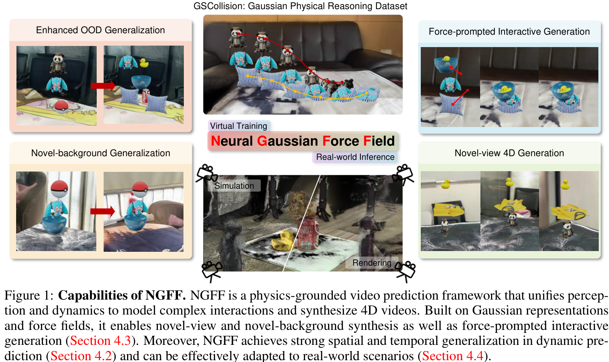
  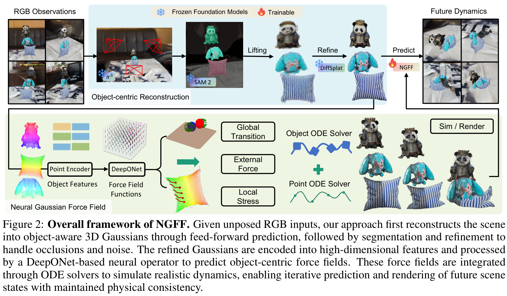

### 1. Metadata
*   **Authors & Lab:** Shiqian Li, Ruihong Shen, Junfeng Ni, Chang Pan, Chi Zhang, Yixin Zhu (Peking University, Tsinghua University)
*   **Code/Data Availability:** https://neuralgaussianforcefield.github.io/

### 2. Core Contribution
*   **Main Problem Statement:** Predicting physical dynamics from visual data requires accurate scene understanding and robust physics reasoning. Existing approaches using 3D Gaussian splatting with traditional physics engines struggle with complex real-world multi-object interactions and prohibitive computational costs.
*   **Novelty / Core Insight:** Neural Gaussian Force Field (NGFF) is an end-to-end framework that learns explicit force fields directly from 3D Gaussian representations, enabling interactive and physically realistic 4D video generation from multi-view RGB inputs.
*   **Methodology / Key Ideas:** 1) Feed-forward 3D Reconstruction: Converts multi-view RGB into object-aware 3D Gaussians using a transformer-based geometry encoder and SAM2 instance masks. 2) Neural Dynamics Simulator: A neural operator (Interaction Network + StressNet) predicts object-centric force fields over a relational graph. 3) Integration: The explicit force fields are integrated via an ODE solver to simulate realistic continuous dynamics, supporting both rigid and soft bodies.
*   **Achievements (Results):** Achieves two orders of magnitude speedup over prior Gaussian simulators. Surpasses SOTA particle-based methods (Pointformer) and video generation models (Veo3, NVIDIA Cosmos) across spatial, temporal, and compositional generalization. Uniquely supports interactive force-prompted generation and robust sim-to-real transfer. Also introduces the GSCollision dataset (~4TB).

### 3. Critical Analysis
*   **Datasets & Baselines:** Evaluated on the newly introduced GSCollision dataset (3,200 scenes, 640k videos). Baselines include Pointformer, GCN, VLM-MPM for physics prediction, and Cosmos, Veo3, PhysGen3D for video generation.
*   **Underlying Assumptions:** Assumes that multi-view inputs are available for reliable feed-forward 3D Gaussian reconstruction. Assumes explicit force field modeling via neural operators on relational graphs is sufficient to capture complex phenomena like material deformation and collisions.
*   **Limitations / Failure Cases:** Currently requires multi-view inputs; performing reliable physical reasoning from single observations or partial views remains a fundamental challenge. Focusing on explicit physical interactions over complex rendering causes a trade-off with photorealistic visual fidelity compared to purely 2D generative video models.
*   **Future Work:** Extending the framework to handle minimal observation requirements (e.g., single views) using generative priors. Scaling to diverse object categories and complex outdoor environments. Leveraging the explicit force fields for causal counterfactual reasoning ("what if" questions).
*   **Strategic Relevance:** Unifies feed-forward Gaussian scene representations with neural dynamics modeling. By explicitly predicting force fields instead of just trajectory coordinates or pixel flows, it achieves highly generalizable and interactive physics-grounded video prediction.

---

# 13. DeGO: Deformable Gaussian Occupancy: Decoupling Rigid and Nonrigid Motion with Factorized Distillation (ICML 2026 / arXiv 2026)

  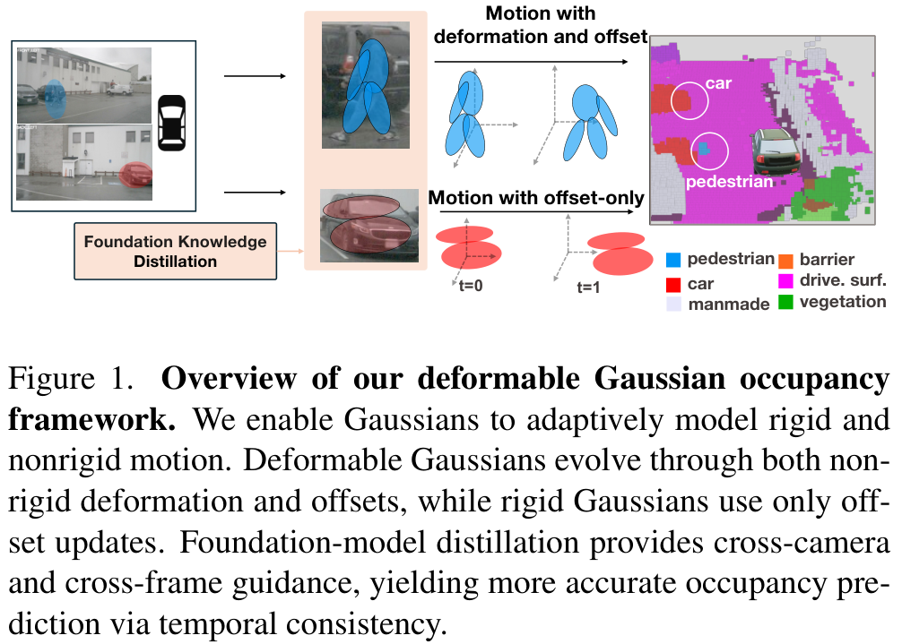
  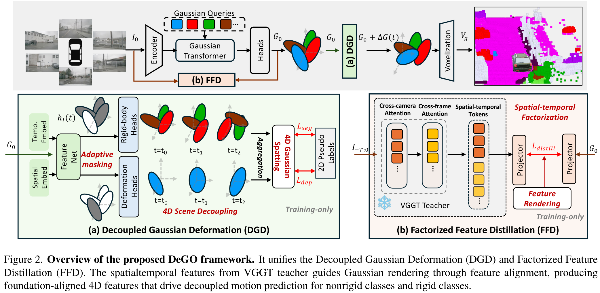

### 1. Metadata
*   **Authors & Lab:** Yang Gao, Wuyang Li, Po-Chien Luan, Alexandre Alahi (EPFL, Switzerland)
*   **Code/Data Availability:** https://github.com/vita-epfl/DeGO

### 2. Core Contribution
*   **Main Problem Statement:** Existing weakly supervised 3D occupancy prediction methods assume rigid-body motion and rely on simple frame-to-frame offsets. This limits their ability to capture the fine-grained nonrigid deformations of human-centric agents (pedestrians, cyclists) and maintain temporal coherence.
*   **Novelty / Core Insight:** DeGO unifies decoupled Gaussian deformation with factorized 4D foundation-model distillation. It introduces a learnable rigid-body mask to adaptively allocate deformation capacity, explicitly separating rigid offset updates from nonrigid shape deformations.
*   **Methodology / Key Ideas:** 1) Decoupled Gaussian Deformation (DGD): Each Gaussian primitive predicts a soft rigidity mask that controls whether it undergoes purely rigid positional offsets (for backgrounds/vehicles) or combined offsets and nonrigid deformations (for humans). 2) Factorized Feature Distillation (FFD): Transfers cross-camera (spatial) and cross-frame (temporal) knowledge from a frozen VGGT 4D foundation model to the Gaussian features, providing temporally consistent pseudo-supervision.
*   **Achievements (Results):** Achieves SOTA on the Occ3D-NuScenes benchmark under weak supervision, delivering a 13.5% gain on human-centric classes (pedestrians, bicycles) and a 10.9% overall mIoU improvement (18.05 mIoU) over the previous best GaussianFlow, while rendering at real-time speeds (>20 FPS).

### 3. Critical Analysis
*   **Datasets & Baselines:** Evaluated on the Occ3D-NuScenes benchmark. Baselines include GaussianFlow, VEON, GaussTR, LangOcc, GaussianOcc, OccNeRF, and SelfOcc.
*   **Underlying Assumptions:** Assumes that human-centric motion can be effectively decoupled from rigid background motion using an implicitly learned rigidity mask without dense supervision. Assumes the pretrained VGGT foundation model provides robust enough spatiotemporal priors for distillation.
*   **Limitations / Failure Cases:** Performance inherently relies on the quality of the 2D pseudo-labels (from Grounded-SAM and Metric3D) and the VGGT teacher model. While efficient, drastically reducing the number of Gaussians degrades the effectiveness of the deformation module compared to rigid representations. Extending the temporal horizon beyond 8 frames begins to degrade accuracy due to error accumulation.
*   **Future Work:** Exploring longer temporal sequences without error accumulation, integrating additional sensing modalities, and large-scale pretraining for broader 4D generalization.
*   **Strategic Relevance:** Successfully bridges the gap between static/rigid Gaussian splatting and highly dynamic human-centric scenes for autonomous driving. It proves that decoupled deformation driven by foundation-model distillation is a scalable path for weakly supervised 4D occupancy modeling.

---

# 14. Spacetime Gaussian Feature Splatting for Real-Time Dynamic View Synthesis (CVPR 2024 / arXiv 2023)

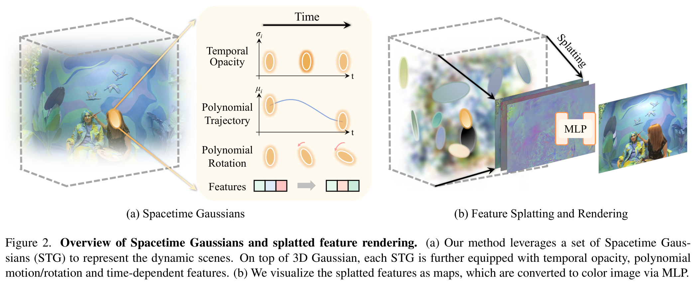

### 1. Metadata
*   **Authors & Lab:** Zhan Li, Zhang Chen, Zhong Li, Yi Xu (OPPO US Research Center, Portland State University)
*   **Code/Data Availability:** https://github.com/oppo-us-research/SpacetimeGaussians

### 2. Core Contribution
*   **Main Problem Statement:** Novel view synthesis of dynamic scenes faces the challenge of simultaneously achieving high-resolution photorealistic results, real-time rendering, and compact storage.
*   **Novelty / Core Insight:** Spacetime Gaussian Feature Splatting, a novel dynamic scene representation that enhances 3D Gaussians with temporal opacity and parametric motion/rotation, and replaces spherical harmonics with splatted neural features for view- and time-dependent appearance.
*   **Methodology / Key Ideas:** 1) Spacetime Gaussians (STG): 3D Gaussians are extended to 4D by adding a temporal radial basis function for opacity (modeling emerging/vanishing content) and polynomial functions for motion trajectories and rotations. 2) Splatted Feature Rendering: Instead of bulky Spherical Harmonics coefficients, compact neural features are splatted and passed through a tiny MLP to produce the final color, reducing size and increasing expressiveness. 3) Guided Sampling: Samples new Gaussians in challenging or distant areas guided by training errors and coarse depth to improve rendering quality.
*   **Achievements (Results):** Achieves SOTA rendering quality and speed with highly compact storage. The lite-version model can render 8K 6-DoF video at 60 FPS on an Nvidia RTX 4090 GPU. Consistently outperforms NeRFPlayer, HyperReel, K-Planes, and Dynamic 3DGS in PSNR and LPIPS while being significantly faster.

### 3. Critical Analysis
*   **Datasets & Baselines:** Evaluated on the Neural 3D Video Dataset, Google Immersive Dataset, and Technicolor Dataset. Baselines include NeRFPlayer, HyperReel, K-Planes, MixVoxels, Dynamic 3DGS, 4DGaussians, and Im4D.
*   **Underlying Assumptions:** Assumes that dynamic motion can be effectively represented by short segments of continuous polynomial motion and rotation. Assumes the scenes have sufficient multi-view coverage for robust Structure-from-Motion (SfM) point cloud initialization.
*   **Limitations / Failure Cases:** The model cannot be trained on-the-fly; it requires offline, per-scene training. Polynomial motion parameterization might struggle with extremely sudden, non-smooth, or highly articulated long-duration motions without breaking the sequence into many smaller segments. It is currently designed strictly for multi-view video inputs, not monocular captures.
*   **Future Work:** Exploring advanced initialization techniques to accelerate the training process for streaming applications. Adapting the approach to monocular settings by combining it with structural regularization or generative priors.
*   **Strategic Relevance:** Represents a major leap in explicit 4D representations. By making opacity time-dependent and modeling motion via continuous polynomials rather than dense grids or discrete per-frame parameters, it radically reduces the memory overhead of dynamic 3DGS, enabling unprecedented 8K real-time rendering.

---

# 15. Real-Time Photorealistic Dynamic Scene Representation and Rendering with 4D Gaussian Splatting (ICLR 2024 / arXiv 2023)

  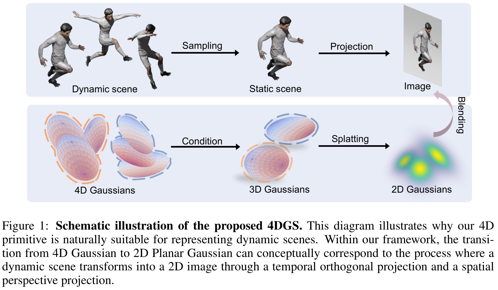
  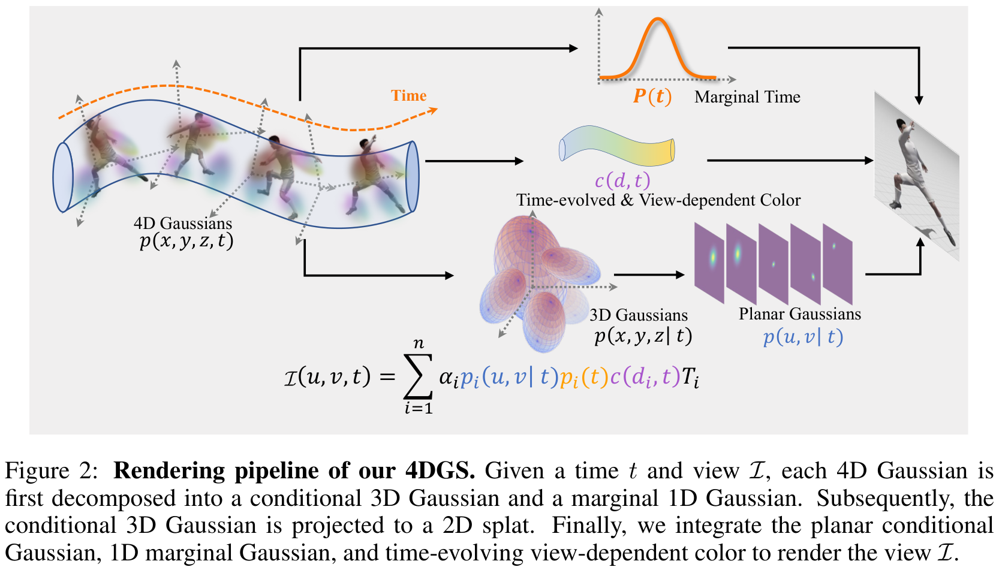

### 1. Metadata
*   **Authors & Lab:** Zeyu Yang, Hongye Yang, Zijie Pan, Li Zhang (Fudan University)
*   **Code/Data Availability:** https://fudan-zvg.github.io/4d-gaussian-splatting

### 2. Core Contribution
*   **Main Problem Statement:** Reconstructing dynamic 3D scenes faces severe scaling challenges when explicitly modeling scene element deformation (like canonical spaces + deformation fields). Existing methods struggle to natively reveal spatial and temporal structure simultaneously.
*   **Novelty / Core Insight:** Proposes treating spacetime as a single entirety. Instead of a 3D Gaussian plus a motion field, this method formulates mathematically rigorous 4D Gaussians that can rotate arbitrarily in 4D space-time, capturing scene intrinsic motion without explicit deformation networks.
*   **Methodology / Key Ideas:** 1) 4D Gaussians: Represented by anisotropic ellipses in 4D Euclidean space. The 4D rotation is decomposed into a pair of isotropic rotations represented by quaternions, allowing the Gaussians to naturally fit the 4D spacetime manifold. 2) 4D Spherindrical Harmonics (4DSH): Generalizes Spherical Harmonics for dynamic scenes by combining standard 3D SH with 1D Fourier series, modeling the time-evolution of view-dependent color. 3) Spacetime Densification: Uses the average gradients of the temporal mean ($\mu_t$) as an additional density control indicator for splitting/cloning.
*   **Achievements (Results):** Achieves SOTA visual quality and efficiency, rendering at 114 FPS on the Plenoptic Video benchmark. Demonstrates superior performance over HexPlane, K-Planes, MixVoxels, and NeRFPlayer in both multi-view and monocular dynamic scene settings.

### 3. Critical Analysis
*   **Datasets & Baselines:** Evaluated on the Plenoptic Video dataset (multi-view), D-NeRF dataset (monocular), and Waymo Open Dataset (urban scenes). Baselines include Neural Volumes, LLFF, DyNeRF, HexPlane, K-Planes, MixVoxels, and NeRFPlayer.
*   **Underlying Assumptions:** Assumes that complex dynamic scene motions can be effectively approximated by a collection of unconstrained 4D Gaussians whose spatial and temporal dimensions are treated equally and can be freely rotated in 4D space.
*   **Limitations / Failure Cases:** In the absence of initial points (e.g., from SfM), the approach struggles to capture distant background areas, even if they are static. It relies heavily on proper initialization for geometry; areas without point cloud initialization might result in a "background map" of Gaussians without physically accurate 3D geometry.
*   **Future Work:** While not explicitly formalized as a major section, the limitations imply a need for better handling of distant backgrounds and initialization techniques that do not rely strictly on dense initial point clouds from SfM.
*   **Strategic Relevance:** Introduces a highly elegant, native 4D mathematical formulation. By treating time exactly like a spatial dimension and introducing 4D Spherindrical Harmonics, it proves that a pure, unconstrained 4D primitive can outperform complex "canonical + deformation" pipelines in both speed and quality.

---

# 16. Dense RGB SLAM with Neural Implicit Maps (ICLR 2023)

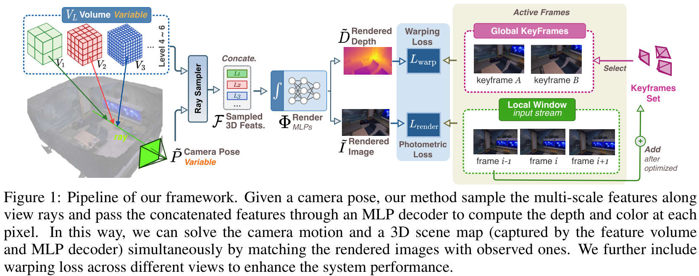

### 1. Metadata
*   **Authors & Lab:** Heng Li, Xiaodong Gu, Weihao Yuan, Luwei Yang, Zilong Dong, Ping Tan (HKUST, Alibaba Group, Simon Fraser University)
*   **Code/Data Availability:** poptree.github.io/DIM-SLAM/

### 2. Core Contribution
*   **Main Problem Statement:** Dense visual SLAM (Simultaneous Localization and Mapping) typically relies on RGB-D sensors. Operating without depth inputs (RGB-only) makes dense map reconstruction highly challenging, especially in featureless regions.
*   **Novelty / Core Insight:** DIM-SLAM is the first dense RGB SLAM method utilizing a neural implicit map representation. It introduces a hierarchical feature volume to facilitate implicit map decoding and employs a multi-scale patch-based photometric warping loss to constrain camera poses and scene geometry without requiring depth sensors.
*   **Methodology / Key Ideas:** 1) Hierarchical Feature Volume: The scene is represented by multi-resolution voxel grids (from 8cm to 64cm) to capture both coarse geometry and fine details. Features are interpolated and concatenated to predict occupancy and color via an MLP. 2) Photometric Warping Loss: To enforce multi-view geometry consistency without depth data, the system warps image patches from one frame to another based on estimated depth and camera poses, calculating structural similarity (SSIM) to optimize the implicit map.
*   **Achievements (Results):** Achieves SOTA mapping and camera tracking performance for dense RGB SLAM. It outperforms or is highly competitive with modern RGB-D methods (like iMAP and NICE-SLAM) in tracking accuracy on benchmarks such as Replica, TUM RGB-D, and EuRoC, despite relying solely on RGB inputs.

### 3. Critical Analysis
*   **Datasets & Baselines:** Evaluated on TUM RGB-D, EuRoC, and Replica datasets. Baselines include iMAP, NICE-SLAM, DI-Fusion (RGB-D) and DROID-SLAM, ORB-SLAM2, TartanVO, SVO, DSO (RGB-only).
*   **Underlying Assumptions:** Assumes that photometric consistency across frames (via patch-based SSIM warping) provides a strong enough signal to accurately optimize both the implicit geometry map and camera poses simultaneously without explicit depth priors.
*   **Limitations / Failure Cases:** Prone to tracking loss during extremely fast camera motions which lead to minimal view overlap between neighboring frames. Textureless regions still pose a challenge if the coarse volume initialization isn't sufficient. Optimizing over multiple hierarchies makes it slower than sparse SLAM methods.
*   **Future Work:** Implies a need for improvements in optimization efficiency (e.g., faster initialization) and incorporating more robust features to handle extremely fast motions or severe occlusions.
*   **Strategic Relevance:** Pushes the boundaries of neural SLAM by removing the reliance on RGB-D cameras. The combination of hierarchical implicit volumes and multi-view photometric patch warping provides a blueprint for scalable, dense 3D reconstruction from casual monocular video captures.

---

# 17. Fast Dynamic Radiance Fields with Time-Aware Neural Voxels (SIGGRAPH Asia 2022)

  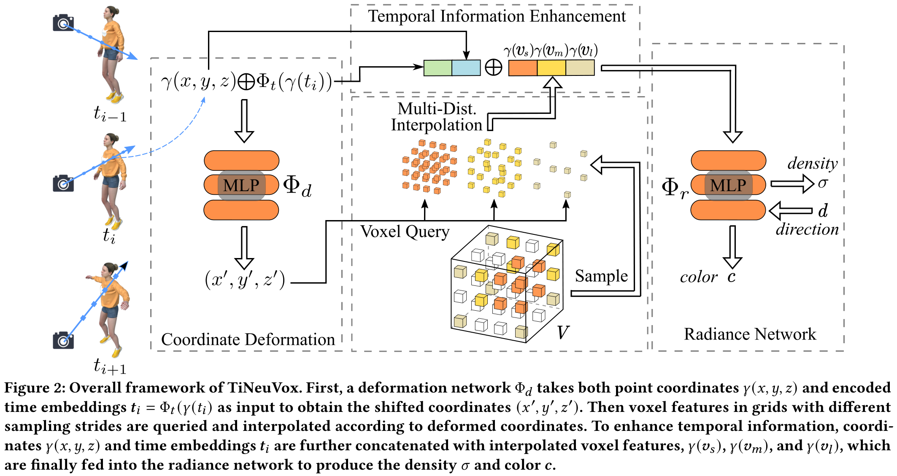
  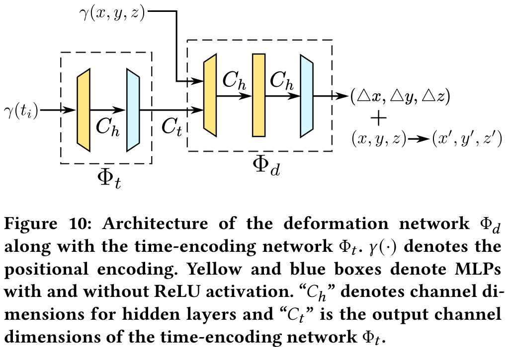

### 1. Metadata
*   **Authors & Lab:** Jiemin Fang, Taoran Yi, Xinggang Wang, Lingxi Xie, Xiaopeng Zhang, Wenyu Liu, Matthias Nießner, Qi Tian (HUST, Huawei, TU Munich)
*   **Code/Data Availability:** https://jaminfong.cn/tineuvox

### 2. Core Contribution
*   **Main Problem Statement:** Conventional Neural Radiance Fields (NeRF) for dynamic scenes take dozens of hours to optimize. While explicit data structures (like voxel grids) have accelerated static NeRFs, applying them to dynamic scenes is challenging due to the massive memory cost of adding a time dimension and the difficulty of capturing both small and large motions.
*   **Novelty / Core Insight:** TiNeuVox is a fast dynamic radiance field framework that uses time-aware neural voxels. It achieves extremely fast convergence (minutes instead of hours) while keeping storage costs very low.
*   **Methodology / Key Ideas:** 1) Coarse Coordinate Deformation: Uses a tiny MLP to shift 3D point coordinates into a canonical space to model coarse trajectories. 2) Temporal Information Enhancement: To compensate for the tiny deformation network's deviations, time and coordinate embeddings are concatenated with the queried voxel features before feeding into the radiance network. 3) Multi-Distance Interpolation (MDI): Instead of building separate multi-resolution voxel grids, MDI interpolates features from a single voxel grid at different sampling strides to effectively model both small and large motions.
*   **Achievements (Results):** TiNeuVox-S trains in just 8 minutes with an 8 MB storage cost, achieving similar or better rendering quality than D-NeRF (which takes 20 hours). The larger TiNeuVox-B achieves higher quality (32.67 PSNR) in 28 minutes. It is 150x faster than D-NeRF and 192x faster than HyperNeRF.

### 3. Critical Analysis
*   **Datasets & Baselines:** Evaluated on the synthetic D-NeRF dataset and real-world scenes from HyperNeRF. Baselines include D-NeRF, T-NeRF, Neural Volumes, NSFF, Nerfies, and HyperNeRF.
*   **Underlying Assumptions:** Assumes that a highly compressed deformation network combined with temporal embeddings passed to the radiance network is sufficient to accurately model complex motion. Assumes that multi-distance interpolation on a single voxel grid can substitute for a full multi-resolution hierarchy.
*   **Limitations / Failure Cases:** The reliance on a single explicit voxel grid can struggle with very sharp reflections or specularity. Extreme, long-distance motions (e.g., a truck moving far away) can lead to wrong voxel queries because the compressed deformation network might only model coarse motions, and MDI might not fully compensate for massive deviations.
*   **Future Work:** Exploring spatial/temporal partitioning of neural networks (e.g., dividing voxels into blocks tracked over time) to handle extremely large motions. Addressing complex specular reflections and integrating geometric/motion priors for domain-specific scenes.
*   **Strategic Relevance:** A seminal work in accelerating dynamic NeRFs. By ingeniously combining a tiny deformation MLP, temporal embeddings, and Multi-Distance Interpolation on a single explicit voxel grid, it proves that dynamic scene rendering can be optimized in minutes rather than days without exploding memory requirements.

---

# 18. D-NeRF: Neural Radiance Fields for Dynamic Scenes (CVPR 2021 / arXiv 2020)

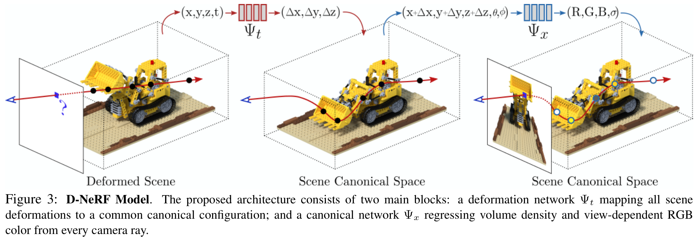

### 1. Metadata
*   **Authors & Lab:** Albert Pumarola, Enric Corona, Gerard Pons-Moll, Francesc Moreno-Noguer (Institut de Robòtica i Informàtica Industrial, CSIC-UPC, Max Planck Institute for Informatics)
*   **Code/Data Availability:** Code, model weights, and datasets released.

### 2. Core Contribution
*   **Main Problem Statement:** Standard NeRF achieves unprecedented photorealism but is strictly applicable to static scenes, failing entirely on scenes with moving or deforming objects because it cannot exploit temporal redundancy.
*   **Novelty / Core Insight:** Introduces D-NeRF, one of the first methods to extend NeRF to dynamic domains by treating time as an additional input and splitting the learning process into two distinct mappings: deformation and canonical appearance.
*   **Methodology / Key Ideas:** Decomposes learning into two main MLP modules: 1) Deformation Network: Takes a 3D point $(x, y, z)$ and time $t$, outputting a displacement $(\Delta x, \Delta y, \Delta z)$ that warps the point to a canonical scene configuration (set at $t=0$). 2) Canonical Network: Regresses volume density and emitted radiance from the canonical coordinates and view direction. Both networks are trained simultaneously end-to-end from a sparse set of monocular views (a single moving camera).
*   **Achievements (Results):** Able to render novel images controlling both the camera view and the time variable, successfully capturing rigid, articulated, and non-rigid motions. Achieves strong results on a custom benchmark of 8 dynamic scenes, outperforming a baseline direct 6D NeRF (T-NeRF). Can also produce time-varying 3D meshes as a byproduct via marching cubes.

### 3. Critical Analysis
*   **Datasets & Baselines:** Evaluated on an extended benchmark of 8 synthetic dynamic scenes (Hell Warrior, Mutant, Hook, Bouncing Balls, Lego, T-Rex, Stand Up, Jumping Jacks). Baselines include the original static NeRF and T-NeRF (a direct MLP mapping from $x,y,z,t$ to color/density).
*   **Underlying Assumptions:** Assumes that objects can move and deform but typically do not appear or disappear (constant topology). Assumes the entire dynamic scene can be mapped back to a single, continuous canonical space.
*   **Limitations / Failure Cases:** Fundamentally cannot handle topological changes (e.g., objects breaking, or tearing apart). It struggles to recover high-frequency details in regions with very severe, non-smooth deformations where the warping field fails to align properly (e.g., blurry arms in the "Jumping Jacks" scene).
*   **Future Work:** While not explicitly sectioned as "Future Work," the limitations point directly to the need for handling complex topological changes, scaling to real-world scenes with multiple cameras, and improving the expressiveness of the deformation capacity.
*   **Strategic Relevance:** A foundational, landmark paper in dynamic neural rendering. The architectural paradigm of separating motion (via a deformation field warping to a canonical space) from appearance (the canonical NeRF) became the standard blueprint for almost all subsequent dynamic and deformable NeRF methods.

---

# 19. Dynamic Neural Radiance Fields for Monocular 4D Facial Avatar Reconstruction (CVPR 2021 / arXiv 2020)

  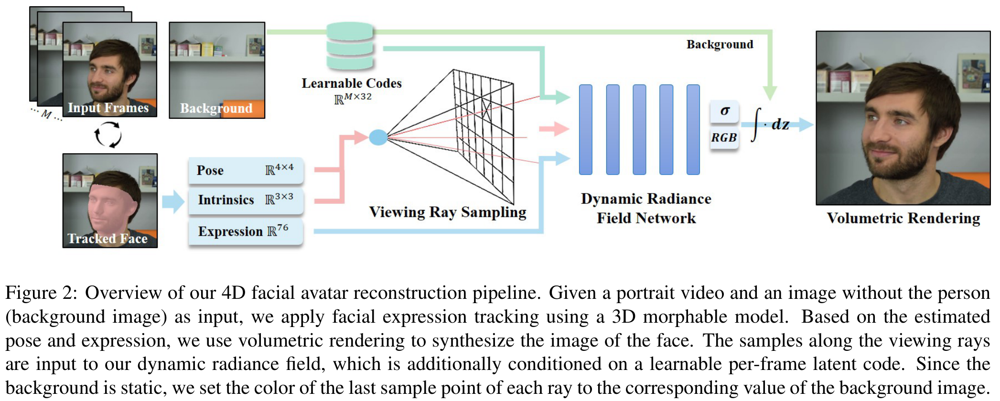
  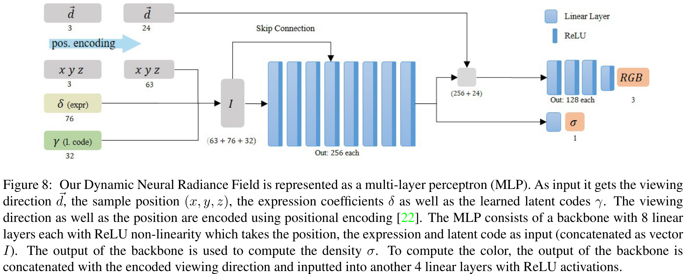

### 1. Metadata
*   **Authors & Lab:** Guy Gafni, Justus Thies, Michael Zollhöfer, Matthias Nießner (Technical University of Munich, Facebook Reality Labs)
*   **Code/Data Availability:** https://gafniguy.github.io/4D-Facial-Avatars

### 2. Core Contribution
*   **Main Problem Statement:** Reconstructing 4D facial avatars (handling complex hair, reflections, and subsurface scattering) from monocular video is extremely challenging. Classical mesh-based methods struggle with mouth interiors and hair, while 2D image-based methods lack 3D view-consistency.
*   **Novelty / Core Insight:** Introduces a dynamic neural radiance field that is explicitly conditioned on a low-dimensional morphable face model (3DMM). This provides explicit control over head pose and facial expressions, enabling the reconstruction of an animatable 4D avatar from a single monocular portrait video.
*   **Methodology / Key Ideas:** 1) Dynamics Conditioning: Uses facial expression coefficients (from an external 3DMM tracker) and a learnable per-frame latent code as inputs to the NeRF MLP to govern facial movements. 2) Deformation via Pose: Uses the rigid pose of the tracked face to transform camera rays into a canonical head space, meaning the NeRF only needs to model localized expression deformations, not overall rigid head movements. 3) Background Decoupling: Uses a static background image capture to self-supervise a foreground-background decomposition, forcing the dynamic NeRF to solely model the person.
*   **Achievements (Results):** Successfully reconstructs controllable 4D facial avatars from short (~2 min) monocular videos. Enables photo-realistic novel view synthesis and facial reenactment (transferring expressions from a source to a target avatar) while maintaining strict 3D consistency (e.g., preserving realistic reflections on glasses).

### 3. Critical Analysis
*   **Datasets & Baselines:** Evaluated on custom captured monocular DSLR datasets. Baselines include Deep Video Portraits (DVP), Deferred Neural Rendering (DNR), and First Order Motion Model (FOMM).
*   **Underlying Assumptions:** Assumes the background is completely static and can be captured separately to simplify foreground segmentation. Assumes a low-dimensional 3DMM tracker is sufficient to parameterize the coarse facial expressions needed to condition the NeRF.
*   **Limitations / Failure Cases:** The reliance on a specific morphable face model means it cannot explicitly control deformations not parameterized by the model (e.g., eye blinks, though they are implicitly correlated with other expressions via the latent code). The model is limited to the head and torso and cannot handle full upper-body or limb dynamics.
*   **Future Work:** Extending the model to reconstruct full upper-body dynamics, provided there is consistent tracking of the torso.
*   **Strategic Relevance:** A pioneering work in controllable dynamic NeRFs. By explicitly conditioning the MLP on semantic parameters (3DMM expression codes) rather than just an abstract time variable, it demonstrated how NeRFs could be utilized for highly controllable, 3D-consistent facial animation and reenactment.

---

# 12. Streaming Visual Geometry Transformer (ICLR 2026 (Under review) / arXiv 2026)

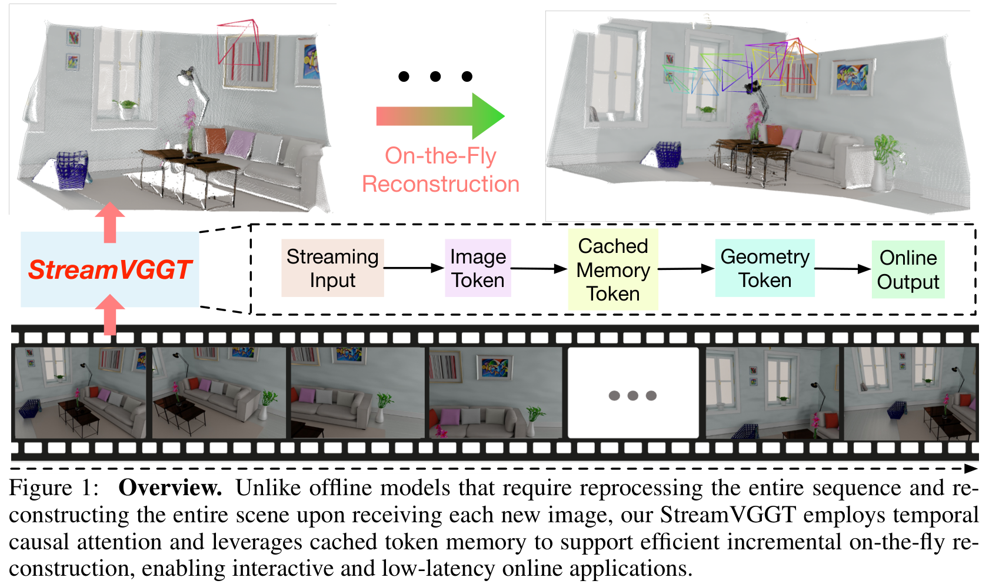
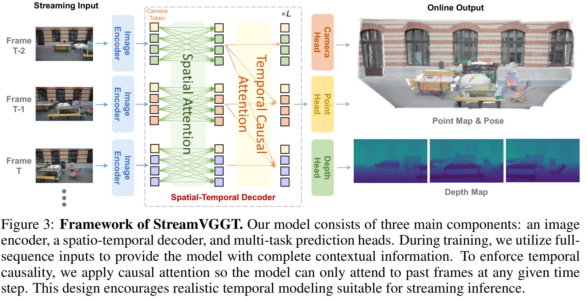

### 1. Metadata
*   **Authors & Lab:** Dong Zhuo, Wenzhao Zheng, Jiahe Guo, Yuqi Wu, Jie Zhou, Jiwen Lu (Tsinghua University)
*   **Code/Data Availability:** https://wzzheng.net/StreamVGGT/

### 2. Core Contribution
*   **Main Problem Statement:** State-of-the-art feed-forward 3D reconstruction models (like VGGT) rely on global self-attention across all frames, making them computationally expensive, memory-intensive, and unsuited for streaming/online applications where inputs arrive sequentially.
*   **Novelty / Core Insight:** StreamVGGT transforms the offline global attention model into a causal, streaming architecture using temporal causal attention and an implicit "cached memory token" mechanism, inspired by autoregressive LLMs.
*   **Methodology / Key Ideas:** 1) Replaces global self-attention with temporal causal attention, restricting each frame to attend only to itself and past frames. 2) Employs a cached memory token (KV cache) mechanism that stores historical context, allowing efficient incremental processing of new frames in O(N) rather than O(N^2). 3) Trained via knowledge distillation (KD) from the bidirectional VGGT teacher to inherit its geometric priors and multi-view consistency without full annotation overhead.
*   **Achievements (Results):** Achieves low-latency online 3D reconstruction (e.g., 0.07s inference per frame vs 4.7s for full-sequence, and 2.7GB vs 5.4GB memory for 10 frames), matching the accuracy of offline models while significantly outperforming state-of-the-art streaming models (like CUT3R, Spann3R) in camera pose and video depth estimation across multiple benchmarks.

### 3. Critical Analysis
*   **Datasets & Baselines:** Evaluated on 7-Scenes, NRGBD, ETH3D, TUM-dynamics, Sintel, Bonn, KITTI. Baselines include DUSt3R, MASt3R, VGGT (offline) and Spann3R, CUT3R, Point3R (streaming).
*   **Underlying Assumptions:** Assumes that causal attention over cached historical tokens is sufficient to replace global bidirectional attention for 3D reconstruction. Assumes the knowledge distillation from an offline teacher (VGGT) is adequate to train a highly capable causal student model.
*   **Limitations / Failure Cases:** The memory footprint still grows linearly with the sequence length due to the accumulation of cached tokens. For extremely long sequences, this scalability issue requires strategies like windowed streaming or K-nearest-frames caching, which might discard critical long-term context (e.g., for global loop closure).
*   **Future Work:** Developing more lightweight memory compression strategies to handle extremely long or infinite video streams without catastrophic memory growth, while maintaining precision.
*   **Strategic Relevance:** Brings the highly successful autoregressive streaming paradigm (with KV caching) from NLP to the domain of 3D visual geometry reconstruction, proving that low-latency, causal 3D perception can match the performance of offline global methods.

---

# 20. 4D Gaussian Splatting for Real-Time Dynamic Scene Rendering (CVPR 2024 / arXiv 2023)

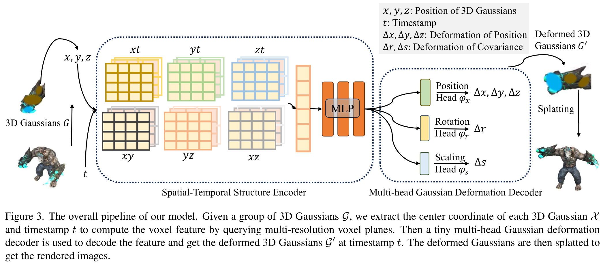

### 1. Metadata
*   **Authors & Lab:** Guanjun Wu, Taoran Yi, Jiemin Fang, Lingxi Xie, Xiaopeng Zhang, Wei Wei, Wenyu Liu, Qi Tian, Xinggang Wang (Huazhong University of Science and Technology, Huawei Inc.)
*   **Code/Data Availability:** https://guanjunwu.github.io/4dgs/

### 2. Core Contribution
*   **Main Problem Statement:** Representing and rendering dynamic scenes efficiently is challenging. NeRF-based methods are slow. While 3D Gaussian Splatting is fast, extending it to dynamic scenes without a massive memory overhead is difficult.
*   **Novelty / Core Insight:** Represents 4D scenes by decoupling the geometry into canonical 3D Gaussians and a continuous 4D deformation field. The deformation field is efficiently parameterized by a multi-resolution HexPlane and a tiny MLP, predicting position, rotation, and scaling offsets for each Gaussian at any given timestamp.
*   **Methodology / Key Ideas:** 1) Spatial-Temporal Structure Encoder: Uses a K-Planes (HexPlane) module to decompose 4D neural voxels into 6 multi-resolution 2D planes, which efficiently encodes both spatial and temporal features of 3D Gaussians. 2) Multi-head Gaussian Deformation Decoder: Decodes the HexPlane features using a tiny MLP to predict spatial, rotational, and scaling deformations. 3) Training involves a warm-up phase for the static 3D Gaussians before jointly optimizing the deformation field.
*   **Achievements (Results):** Achieves real-time rendering of dynamic scenes at 82 FPS (800x800 resolution) and 30 FPS (1352x1014) on an RTX 3090 GPU, while maintaining or surpassing SOTA rendering quality (e.g., PSNR 34.05 on synthetic data). Uses extremely low storage (e.g., 18 MB for a synthetic scene).

### 3. Critical Analysis
*   **Datasets & Baselines:** Evaluated on synthetic D-NeRF datasets, and real-world HyperNeRF and Neu3D datasets. Baselines include TiNeuVox, K-Planes, HexPlane, 3D-GS, FFDNeRF.
*   **Underlying Assumptions:** Assumes the dynamic scene can be mapped smoothly to a single canonical space. Assumes the low-rank structure of the HexPlane is sufficient to capture the complexity of the dynamic motion.
*   **Limitations / Failure Cases:** Struggles to split the joint motion of static and dynamic Gaussians under monocular settings without additional supervision. Large motions, absence of background points, or imprecise camera poses cause the optimization to fail. The HexPlane's low-rank assumption can limit its ability to model extremely complex, high-rank dynamic deformations.
*   **Future Work:** Designing a more compact algorithm to handle urban-scale reconstruction, as heavy querying of the deformation field by a massive number of Gaussians becomes a bottleneck. Exploring better priors to handle large motions.
*   **Strategic Relevance:** Introduces a highly effective paradigm for 4D generation: keeping 3D Gaussians explicitly in a canonical space and learning a continuous deformation field to manipulate their attributes over time. This preserves the rendering speed of 3DGS while enabling dynamic scenes.

---

# 21. Deformable 3D Gaussians for High-Fidelity Monocular Dynamic Scene Reconstruction (CVPR 2024 / arXiv 2023)

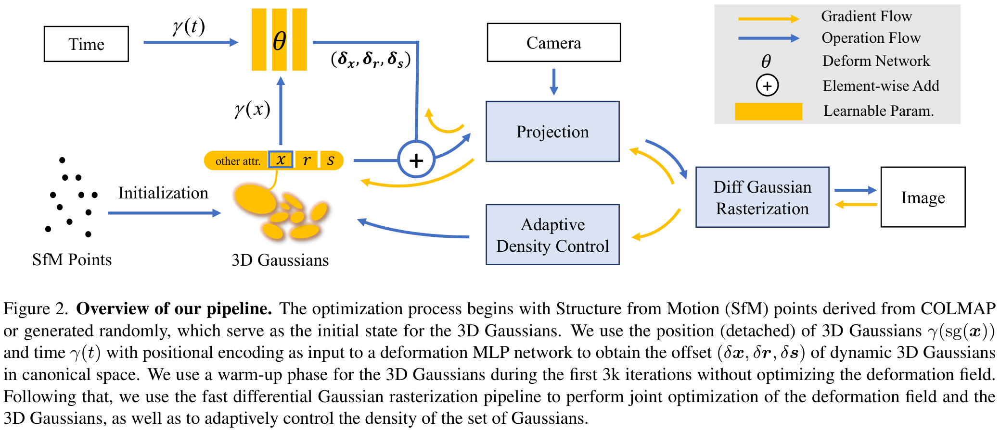
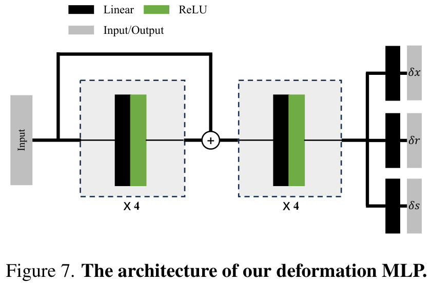

### 1. Metadata
*   **Authors & Lab:** Ziyi Yang, Xinyu Gao, Wen Zhou, Shaohui Jiao, Yuqing Zhang, Xiaogang Jin (Zhejiang University, ByteDance Inc.)
*   **Code/Data Availability:** https://github.com/ingra14m/Deformable-3D-Gaussians

### 2. Core Contribution
*   **Main Problem Statement:** Existing implicit neural rendering methods struggle to capture intricate details of objects and fail to achieve real-time rendering in general dynamic scenes.
*   **Novelty / Core Insight:** Reconstructs dynamic scenes by learning 3D Gaussians in a canonical space along with an MLP-based deformation field to model the dynamics. It explicitly avoids grid/plane-based structures (which rely on low-rank assumptions) to better capture high-rank dynamic motions, and uses Annealing Smooth Training (AST) to handle noisy real-world poses.
*   **Methodology / Key Ideas:** 1) Canonical 3D Gaussians + Deformation Field: The deformation network takes the detached 3D Gaussian position and time (with positional encoding) as input, predicting offsets for position, rotation, and scaling using an MLP. 2) Annealing Smooth Training (AST): Adds time-decaying Gaussian noise to the temporal input during training to mitigate the impact of inaccurate camera poses and improve temporal interpolation smoothness. 3) Differentiable Rendering: Deformed Gaussians are directly splatted into the image plane using the standard 3D-GS pipeline.
*   **Achievements (Results):** Achieves real-time rendering (up to 140 FPS on a 3090 GPU for <250k Gaussians) and high-fidelity novel view synthesis and time interpolation, outperforming baselines like HyperNeRF and TiNeuVox, especially in handling large motions and delicate structures.

### 3. Critical Analysis
*   **Datasets & Baselines:** Evaluated on D-NeRF (synthetic), NeRF-DS, and HyperNeRF (real-world) datasets. Baselines include 3D-GS, TiNeuVox, HyperNeRF, NeRF-DS.
*   **Underlying Assumptions:** Assumes that an MLP with positional encoding has sufficient capacity to model the entire 4D deformation field without needing the spatial acceleration of a feature grid, avoiding the low-rank limitations of planes/grids.
*   **Limitations / Failure Cases:** The method is highly sensitive to the accuracy of camera pose estimations (e.g., COLMAP errors on HyperNeRF datasets degrade performance). Extreme motions or scenes with very sparse viewpoints lead to overfitting or optimization failure. The temporal complexity scales with the number of 3D Gaussians, increasing training duration and memory for very large scenes.
*   **Future Work:** Exploring ways to handle intricate human motions (e.g., nuanced facial expressions) and developing better interpolation methods to enlarge/reduce 4D Gaussians dynamically.
*   **Strategic Relevance:** Serves as an important counterpoint to grid-based deformation approaches (like HexPlane). By relying purely on an MLP and introducing AST, it shows how to effectively model high-rank deformations and handle real-world pose inaccuracies in 4D Gaussian Splatting.

---

# 22. Dream-in-4D: A Unified Approach for Text- and Image-guided 4D Scene Generation (CVPR 2024 / arXiv 2023)

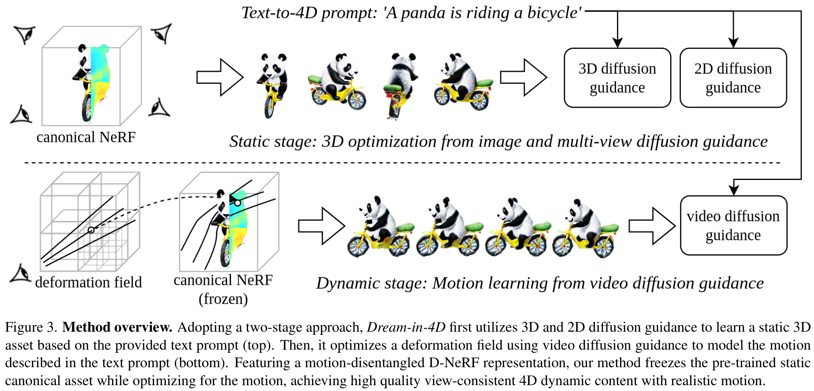

### 1. Metadata
*   **Authors & Lab:** Yufeng Zheng, Xueting Li, Koki Nagano, Sifei Liu, Karsten Kreis, Otmar Hilliges, Shalini De Mello (NVIDIA, ETH Zurich, Max Planck Institute)
*   **Code/Data Availability:** https://research.nvidia.com/labs/nxp/dream-in-4d/

### 2. Core Contribution
*   **Main Problem Statement:** Text-to-4D dynamic scene generation is challenging. Relying solely on video diffusion models leads to the Janus problem (multi-view inconsistency) and poor 3D geometry, as video models lack strong 3D awareness.
*   **Novelty / Core Insight:** Dream-in-4D uses a two-stage approach that explicitly disentangles static 3D asset generation from its motion/deformation. It leverages both 2D and 3D diffusion guidance for the static stage, and video diffusion guidance for the dynamic stage, keeping the canonical static asset frozen to preserve quality.
*   **Methodology / Key Ideas:** 1) Static Stage: Optimizes a canonical NeRF using Score Distillation Sampling (SDS) from both a 3D-aware diffusion model (MVDream) and a 2D image diffusion model (StableDiffusion) to get a high-quality, view-consistent 3D asset. 2) Dynamic Stage: Freezes the static NeRF and trains a 4D deformation field (using a multi-resolution feature grid) using video diffusion guidance (Zeroscope). 3) Employs a novel Total Variation (TV) loss on the 3D displacement field to reduce spatial and temporal jitter.
*   **Achievements (Results):** Significant improvements in visual quality, 3D consistency, and motion realism over baselines like MAV3D. The clear disentanglement allows the method to easily adapt to image-to-4D and personalized 4D generation by simply replacing the image diffusion model in stage 1.

### 3. Critical Analysis
*   **Datasets & Baselines:** User preference studies evaluated against MAV3D and ablative baselines. Evaluated on unconstrained text-to-4D, image-to-4D, and personalized 4D generation tasks.
*   **Underlying Assumptions:** Assumes that dynamic 4D scenes can be effectively represented by a completely static canonical 3D object that undergoes purely spatial deformation over time. Assumes that video diffusion models (like Zeroscope) provide sufficient motion priors to guide the deformation field via SDS.
*   **Limitations / Failure Cases:** The combination of 3D and 2D diffusion priors can still fail to learn the correct static 3D representation for difficult prompts (e.g., "a robot playing a violin"). If the static stage fails (e.g., incorrect hand position), the dynamic stage cannot recover and will fail to learn plausible motion.
*   **Future Work:** Improving the robustness of the static 3D generation step using advances in 3D and 2D diffusion models.
*   **Strategic Relevance:** Provides a highly flexible and unified framework for 4D generation. By strictly disentangling the canonical asset from its motion and using a multi-resolution deformation grid, it solves the quality degradation issues seen in earlier coupled methods (like MAV3D's hexplane).
